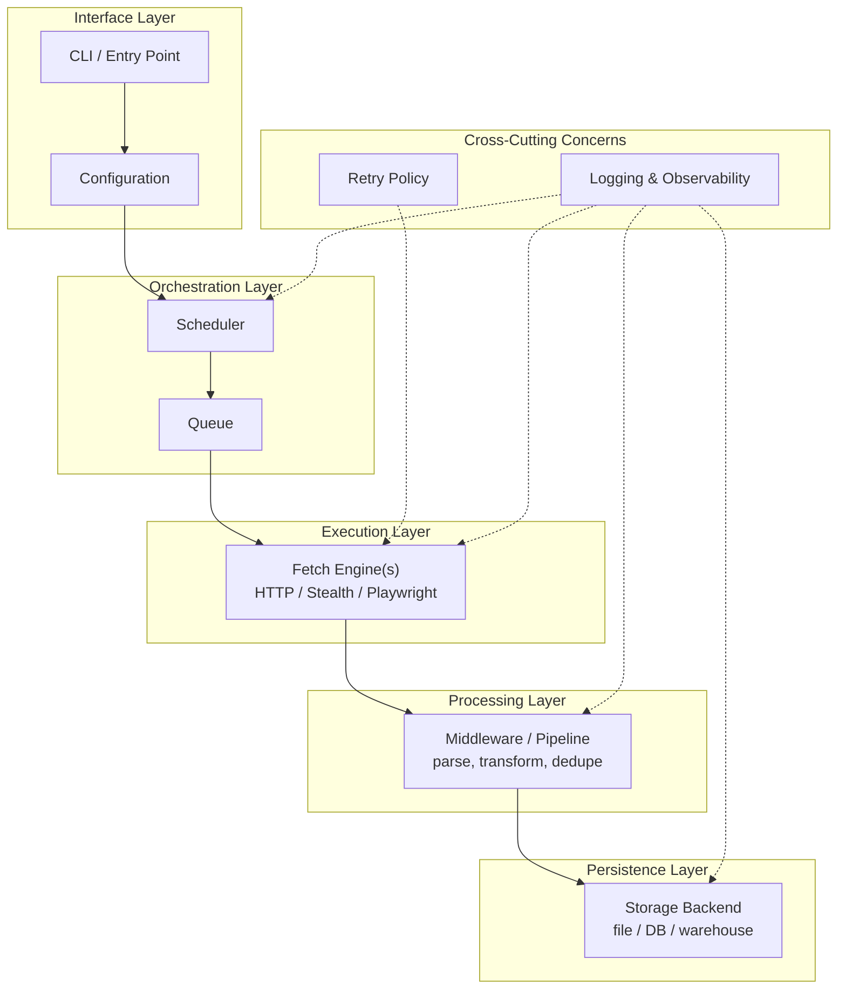
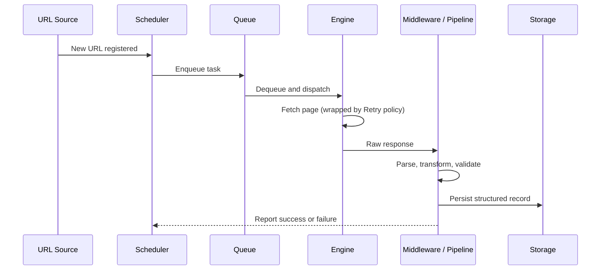
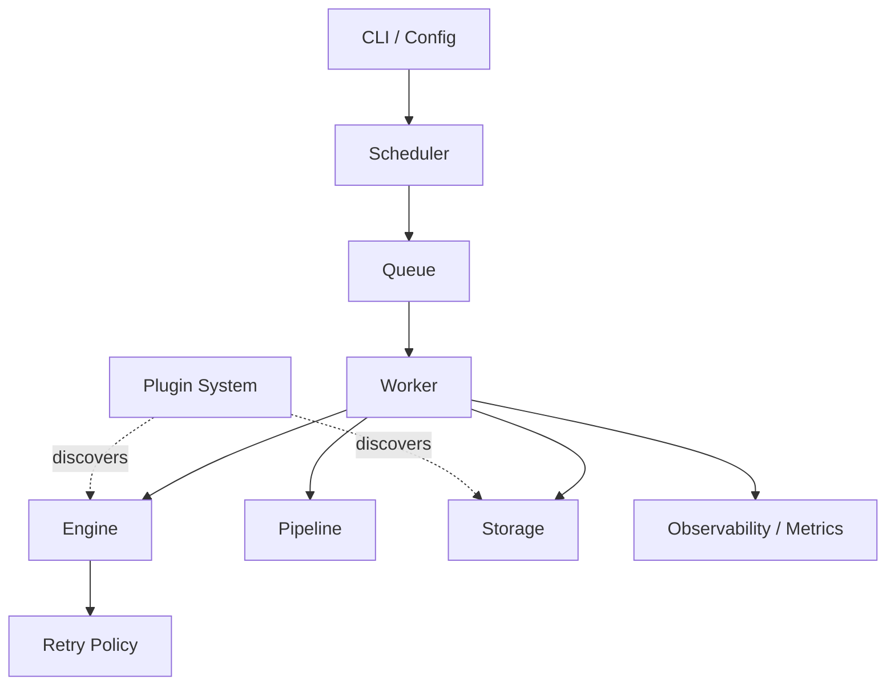
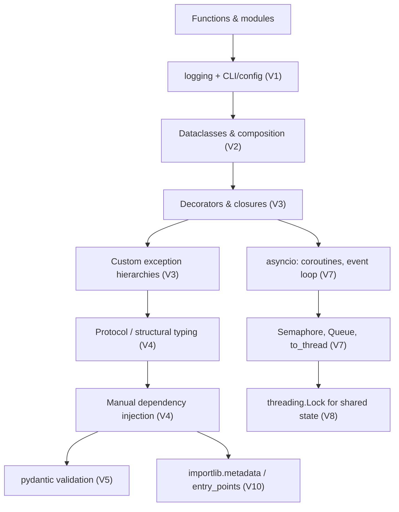
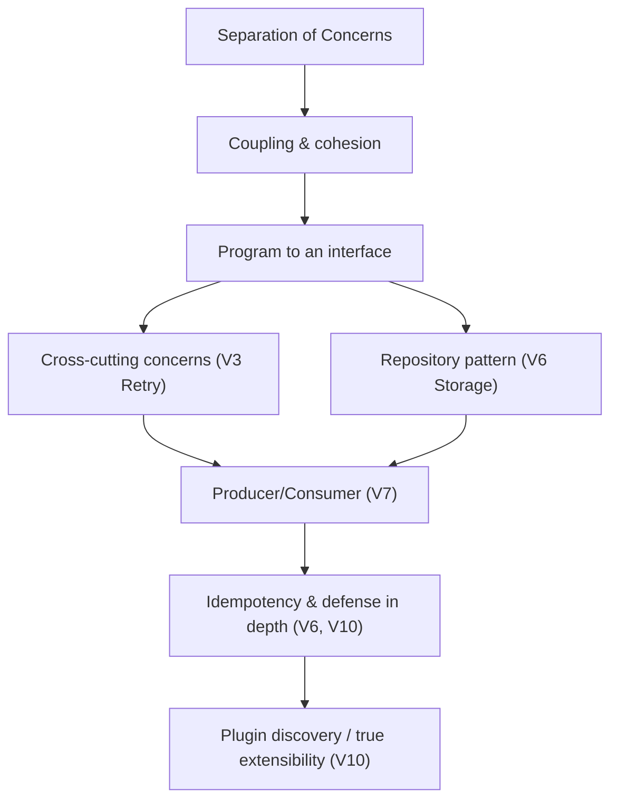
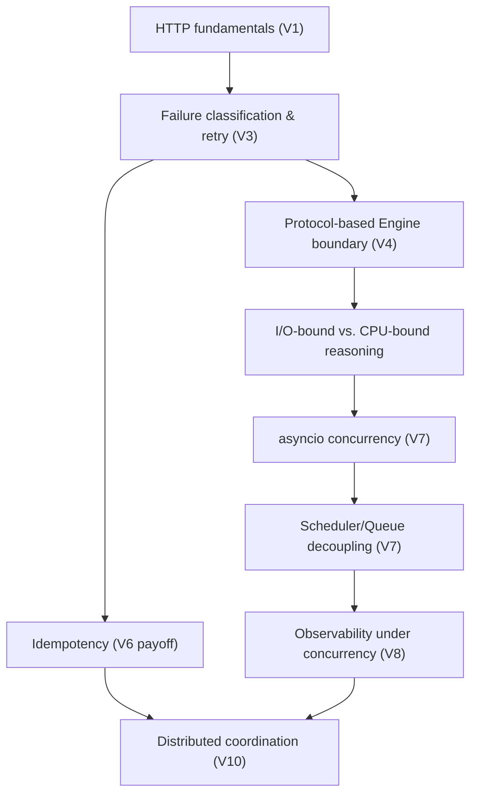
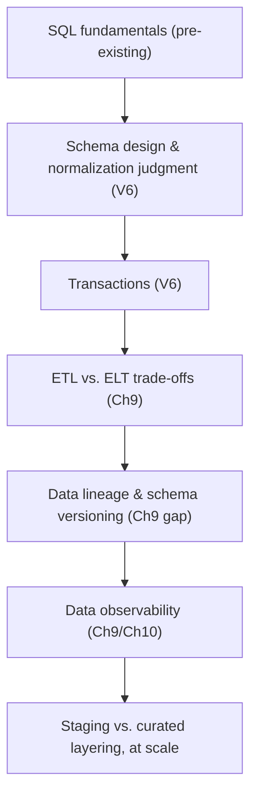
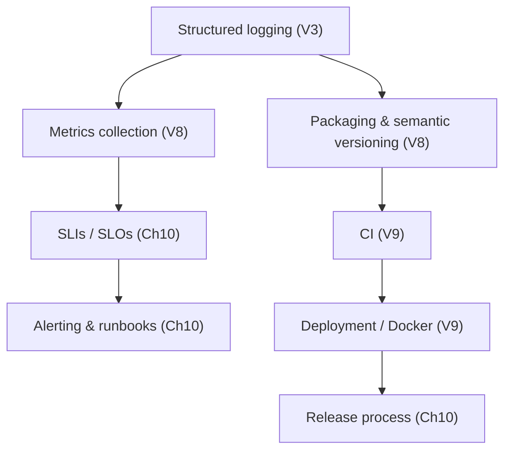
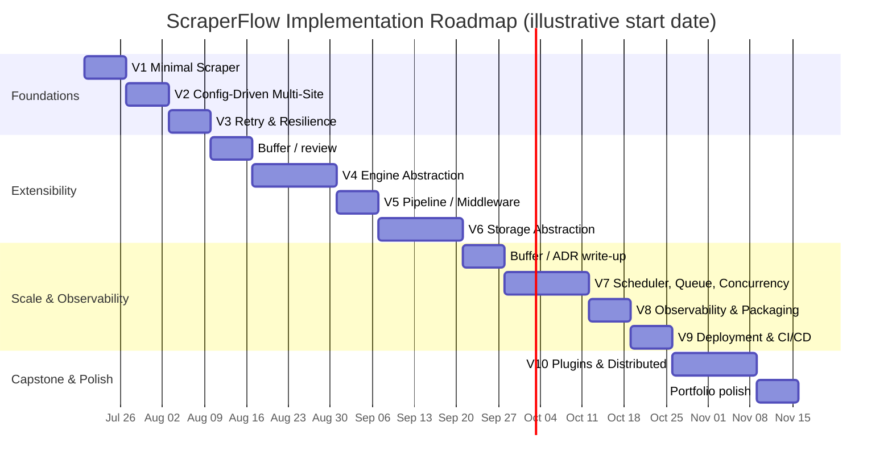

# ScraperFlow Engineering Handbook

### Building Production Judgment Through an Open-Source Web Crawling Framework

---

## How to Use This Handbook

This is not a spec you implement top to bottom. It's an internal engineering handbook, written the way a staff engineer would write one for a mid-level engineer joining a long-running project — and it's designed to be read **in the order you'll need it**, not the order it's numbered.

A few ground rules for how this document will work:

- **It's delivered in parts.** Fourteen chapters at the depth you asked for (reasoning before implementation, trade-offs, EDRs, interview framing, checkpoints) is a book, not a message. I'll extend this same file chapter by chapter across our conversations. Just say "continue" and I'll pick up where we left off.
- **It's a living document.** As you actually build ScraperFlow and hit real decisions, we'll come back and either add Engineering Decision Records to the relevant chapter or revise earlier chapters if reality disagrees with the plan. That revision *is* part of the learning — plans that survive contact with a real codebase unchanged are rare, and pretending otherwise would teach you the wrong lesson.
- **Chapters 1–2 have no code yet, on purpose.** You explicitly said your biggest challenge isn't writing code — it's engineering judgment. If I opened with folder structures and class diagrams, I'd be teaching you to imitate a shape, not to reason. So we start with an honest assessment of where you stand, and the mental models experienced engineers use, before a single line of ScraperFlow exists.

### Full Table of Contents (status as of this part)

| # | Chapter | Status |
|---|---------|--------|
| 1 | Current Skill Assessment | ✅ Part 1 |
| 2 | How Experienced Engineers Think | ✅ Part 1 |
| 3 | Project Vision | ✅ Part 2 |
| 4 | Architecture Principles | ✅ Part 2 |
| 5 | High-Level Architecture | ✅ Part 2 |
| 6 | Architecture Evolution (V1 → VN) | ✅ Complete (compacted) |
| 7 | Detailed Component Design | ✅ Complete |
| 8 | Software Engineering Concepts | ✅ Complete |
| 9 | Data Engineering Concepts | ✅ Complete |
| 10 | Production Engineering | ✅ Complete |
| 11 | Learning Roadmap (dependency graphs) | ✅ Complete |
| 12 | Implementation Roadmap (week-by-week) | ✅ Complete |
| 13 | Interview Preparation | ❌ Dropped (redundant with existing per-chapter questions) |
| 14 | Recommended Resources | ✅ Complete — **Handbook finished** |

---

# Chapter 1 — Current Skill Assessment

## 1.1 What You Already Know (and Why It's More Valuable Than You Think)

Let's start with an honest inventory, because you undersell some of this.

**Python fundamentals.** Functions, modules, packages, classes, basic inheritance, exceptions, virtual environments — you called this "comfortable production code," and that's accurate. This is table stakes, but table stakes matter: a huge number of engineers with several years of experience still write functions that do too much, catch exceptions too broadly, or organize code by "where I happened to put it" rather than by responsibility. If your code already reads cleanly at the function level, you have a real foundation to build architectural thinking on top of. Architecture without clean code underneath it is just decoration.

**SQL.** Intermediate — SELECT, JOIN, GROUP BY, CTEs, window functions, CASE, aggregates. This is a genuinely strong toolkit. A lot of backend engineers *never* get this comfortable with SQL because ORMs hide it from them. This will matter more than you think once ScraperFlow starts persisting structured data — window functions in particular are exactly the tool you'll reach for when deduplicating scraped records or detecting change-over-time in crawled data.

**Web scraping.** You called this your strongest area, and I want to push back gently on how you're framing it. You're treating it as "a skill I happen to have," but web scraping at a production level is actually one of the more architecturally demanding specializations in backend engineering, and most people who haven't done it don't realize this. Consider what you already have working knowledge of:

- HTTP semantics well beyond "GET a URL" — headers, cookies, sessions, redirects, content negotiation
- Browser rendering behavior (via Playwright) — meaning you understand asynchronous page state in a way most backend-only engineers don't
- Anti-bot and evasion patterns — which means you already think about adversarial systems, rate limits, and detection, concepts most CRUD-app engineers never touch
- Pagination, infinite scroll, click-driven navigation — state machines, even if you haven't called them that
- API discovery via DevTools — reverse-engineering undocumented contracts, a skill closer to security research than typical web dev

The reason this matters for this project: **you are not learning architecture from zero.** You already have deep intuition about failure modes (sites change, requests get blocked, pages time out) — you just haven't yet had a framework of vocabulary and patterns to organize that intuition into reusable design decisions. That's a much shorter distance to travel than "person who has only ever built CRUD apps and has never seen a system fail in the wild."

**Data engineering.** Snowflake, Airflow, ETL, ingestion, transformation — intermediate, execution-level. You know how to *operate inside* a pipeline someone else architected. What you haven't done yet is decide the shape of that pipeline yourself, under constraints, and defend the decision.

**FastAPI.** Basic to intermediate — you can build simple APIs but haven't had to reason about production concerns (DI, middleware, auth, background tasks).

**DevOps.** Honestly, very limited, by your own account. This is the one area where I'd flag: don't try to backfill this independently by reading Docker/Kubernetes docs in isolation. It will click ten times faster once ScraperFlow actually needs to be deployed and you feel the specific pain that containers and CI/CD solve. We'll get there in Chapter 10 and the implementation roadmap — not before it's earned.

The overall picture: **you know how to make things work. You don't yet have much practice deciding how things should be shaped before you make them work, or how they should keep working after requirements change.** That's not a knowledge gap in the sense of missing facts — it's a gap in a specific kind of judgment, and judgment is trained differently than facts are. You can't read your way to it; you have to make decisions, see consequences, and reflect. That's exactly the loop this handbook is structured around.

## 1.2 What You Probably Don't Know Yet

Being direct, because vague encouragement won't help you close these gaps. Grouped by category:

**Python, beyond the basics you listed:**
- Abstract Base Classes and `Protocol` — how Python expresses "this must support these operations" without inheritance
- Generics and `TypeVar` — writing code that's type-safe *and* reusable across types
- Dependency Injection — not a framework feature, a design habit: passing collaborators in instead of constructing them internally
- Context managers (`__enter__`/`__exit__`, `contextlib`) — the idiomatic Python way to guarantee cleanup
- Decorators beyond `@property` — how retry logic, caching, and logging get attached to functions without polluting their bodies
- Metaclasses — you likely don't need these for a long time, and that's fine; they're rarely the right tool
- `asyncio` — event loops, coroutines, `async`/`await`, concurrency vs. parallelism
- Packaging and library design — `pyproject.toml`, entry points, versioning, what makes a codebase *installable and importable* by someone else, not just runnable by you

**Architecture and design:**
- Design patterns as a *vocabulary*, not just as code shapes — Strategy, Factory, Observer, Adapter, Template Method, Chain of Responsibility (several of these will show up naturally in ScraperFlow, and we'll name them when they do, not before)
- Dependency inversion — depending on abstractions rather than concrete classes, and why that specifically enables testability and swappability
- Plugin/extension architecture — how frameworks let third parties add behavior without modifying core code

**Data engineering, deeper layer:**
- Data modeling (normalized vs. dimensional, schema evolution)
- Streaming concepts and Kafka fundamentals
- Storage format trade-offs (JSON vs. Parquet vs. columnar formats, and *why* they exist)
- Warehouse design principles beyond "write SQL against tables someone else made"

**Databases:**
- Query optimization, indexing strategy, reading execution plans, transaction isolation levels — these are execution-detail skills that mostly get learned by hitting real performance problems, which ScraperFlow's storage layer will eventually give you

**Production/DevOps:**
- Docker (images, layers, multi-stage builds)
- CI/CD pipelines (what actually runs on every commit and why)
- Basic Kubernetes concepts (pods, deployments, services) — not mastery, just literacy
- Cloud deployment fundamentals

This list looks long. It isn't meant to intimidate you — it's meant to replace vague anxiety ("I don't know enough") with a concrete map ("here are eighteen specific things, and I now know their names"). Concrete gaps are learnable. Vague ones just produce imposter syndrome.

## 1.3 What Senior Engineers Know That You Likely Don't

This is the part most gap-analyses skip, and it's the part that actually matters most for your stated goal. It is *not* a longer list of technologies. Senior engineers are not senior because they know more frameworks. They're senior because of a small number of judgment capabilities:

**1. They know when *not* to add abstraction.** A junior engineer who just learned the Strategy pattern will use it everywhere. A senior engineer asks: "do I actually have two implementations right now, or am I building a coat rack for a coat I don't own yet?" Restraint is a skill, and it's learned by having been burned by premature abstraction at least once.

**2. They think in terms of the cost of being wrong, not the cost of being incomplete.** Every design decision is a bet made under uncertainty. Senior engineers ask "if this assumption turns out false in six months, how expensive is it to change?" rather than "is this the most correct design possible today?" This is why you'll see experienced engineers deliberately ship something simple that they *know* isn't the final shape — they're managing the cost of reversibility, not chasing perfection.

**3. They can name what they're doing.** This might sound like a superficial point, but it isn't. When a senior engineer separates retry logic from business logic, they can say "this is Separation of Concerns, because retry policy and parsing logic change for different reasons, at different rates, owned by different mental models." That vocabulary is what makes a decision *reviewable, teachable, and defensible in an interview.* You may already have good instincts here from scraping — you just haven't had to narrate them yet.

**4. They understand that architecture decisions are shaped by organizational forces, not just technical ones.** Team size, on-call rotation, deployment frequency, and who owns which part of the system all push the "right" architecture in different directions. A solo open-source maintainer and a twenty-person platform team would reasonably build different versions of the same system. Senior engineers ask "who has to live with this, and how often does it change hands?" before they ask "what's the cleanest pattern?"

**5. They write decisions down.** Not out of bureaucratic habit — because six months later, nobody (including future-you) remembers *why* a choice was made, only that it was made. Undocumented decisions calcify into things nobody dares touch. This is why this handbook insists on Engineering Decision Records starting in Chapter 4: we're building that habit into you from day one, not bolting it on later.

**6. They know what varies and what's stable, and they design the seams accordingly.** This is probably the single most transferable skill in this whole list. Good architecture isn't "clean" in some aesthetic sense — it's structured so that the things likely to change (which HTML parser you use, which storage backend, which retry policy) are isolated behind small, stable interfaces, while the things unlikely to change (the overall data flow) stay simple and undecorated. Bad architecture abstracts things that never change and hardcodes things that constantly do.

None of these six things require you to learn a new framework. They require *practice making decisions and being asked to justify them.* That is precisely what this handbook is structured to give you — every chapter from Chapter 4 onward will force you through this loop deliberately.

## 1.4 Why You Currently Lack Confidence (and Why That's Structural, Not Personal)

I want to name this directly, because I think it's costing you more than it should: **your confidence gap isn't a sign that you're behind. It's a predictable side effect of the kind of work you've been doing.**

Here's the mechanism. In most jobs — including, most likely, yours — architectural decisions are made once, early, usually by someone more senior or by whatever framework/team convention already existed before you arrived. Your job as a 4-year engineer doing scraping and data engineering work has probably been to *execute inside* decisions that were already made: "build a scraper for this site," "add a transformation to this pipeline." That's genuinely valuable work, and it's also work that, by its nature, rarely exposes you to the "why" behind the surrounding structure — because by the time a ticket reaches you, the architecture question has already been settled upstream.

A few concrete reasons this produces exactly the confidence gap you're describing:

- **You haven't watched your own early decisions age badly.** Architectural intuition is mostly built by living with the consequences of choices — the abstraction that turned out to be wrong, the shortcut that turned out fine, the "temporary" hack that's still there three years later. If you've mostly worked inside systems someone else designed, you haven't accumulated that scar tissue yet, and scar tissue is most of what "senior instinct" actually is.
- **You haven't had to defend decisions out loud.** Vocabulary and confidence come from being asked "why did you structure it this way?" in a design review and having to answer in real time. If that hasn't happened to you often, the instincts might be there, but the *language* to express and defend them isn't — and without the language, it's hard to feel confident even when you're right.
- **Task-based work optimizes for a different skill.** You've gotten very good, by your own account, at "make this scraper work against this specific, adversarial, constantly-changing website." That is a hard skill. It is also a *different* skill from "decide how forty scrapers, a scheduler, a storage layer, and a retry system should relate to each other." Being excellent at one doesn't automatically transfer to the other — but the good news is that the transfer is learnable, and faster than starting from zero, because you already understand failure modes deeply.

This is normal at four years of experience, and it is exactly the gap that deliberate architecture practice — which is what you're doing right now by building this project this way — closes. The fact that you can articulate the gap this precisely (down to naming "should this be a service, manager, middleware, plugin, or utility?" as your specific confusion) tells me your instincts are ahead of your vocabulary. That's a good position to be building from.

## 1.5 How Experienced Engineers Approach Architecture Differently

To make this concrete rather than motivational, here's a direct contrast:

| Situation | Novice approach | Senior approach |
|---|---|---|
| Starting a new project | "What's the best architecture for this?" | "What's the smallest structure that satisfies today's real requirements, with seams in the right places?" |
| Learning a new pattern | Applies it to the next thing they build, everywhere | Waits until the same problem appears 2-3 times, *then* reaches for the pattern |
| Facing an unclear requirement | Tries to design for every possibility | Asks what's actually known vs. assumed, and defers decisions that don't need to be made yet |
| Naming a design choice | "It felt right" | "This isolates X because X changes independently of Y, for reason Z" |
| Encountering duplicated code | Immediately abstracts it | Asks whether the duplication is *coincidental* (two things that look similar today but will diverge) or *essential* (truly the same concept) before abstracting |
| Reviewing their own past code | Either defends it or feels embarrassed | Treats it as a decision made under yesterday's information — updates it without ceremony |

The throughline in every senior-approach column: **architecture is treated as an ongoing series of small, reversible bets made explicit, not a single big decision made correctly once.** That reframing is probably the single most important idea in this entire handbook, and it's why Chapter 6 (Architecture Evolution) exists as a first-class chapter rather than an afterthought — ScraperFlow's design is deliberately going to be built as a sequence of versions, each one a bet appropriate to what you actually know and need at that stage.

## 1.6 Learning Priorities — Your Baseline

Given everything above, here's how I'd prioritize your learning as we build ScraperFlow, roughly in order:

1. **Architectural decision-making practice**, via real decisions on this project, documented as EDRs — this is the actual bottleneck, not a knowledge gap fillable by reading.
2. **Production-hygiene concepts early** (configuration management, logging, testing structure) — these are cheap to build in from the start and expensive to retrofit, so we introduce them well before they feel "needed."
3. **Advanced Python concepts introduced exactly when a real problem calls for them** — not studied standalone. You'll learn `Protocol` the day you need to define "any engine that can fetch a page," not before.
4. **Data engineering depth, once ScraperFlow's storage layer forces the question** — schema design, storage formats, and eventually streaming concepts, timed to when the project's data volume/shape actually creates the need.
5. **DevOps/deployment concerns in the back half of the project**, once there's something real worth deploying, containerizing, and automating.

### Chapter 1 Checkpoint

**Knowledge gained:** An honest, specific map of your current skills versus the skills this project will build — not "I need to learn more," but eighteen named things.

**Engineering mindset learned:** That the gap you feel isn't about missing facts — it's about missing *practice narrating and defending decisions*, which is a structural byproduct of task-based work, not a personal shortcoming.

**Interview readiness:** You should now be able to answer, in an interview, "what are you weakest at as an engineer, and why?" with a specific, self-aware answer instead of a vague one — that specificity itself reads as seniority.

**Prerequisites for Chapter 2:** None — this is the next chapter.

**Reflection questions** (worth actually writing answers to, not just reading):
- Think of one piece of code you shipped in the last year that you'd structure differently today. What changed — the requirements, or your understanding?
- Of the six senior-engineer capabilities in 1.3, which one do you think you're closest to already, based on your scraping experience?

---

# Chapter 2 — How Experienced Engineers Think

## 2.1 Engineering as Trade-off Management Under Constraints

Here's the mindset shift this whole chapter is built around: **stop asking "what's the correct architecture?" and start asking "what's the appropriate architecture given these specific constraints?"**

There is very rarely a single correct design in software engineering. There are designs that are appropriate to a context — team size, expected load, rate of change, tolerance for failure, time budget — and designs that ignore that context in favor of an abstract ideal. A design that's "correct" for a twenty-engineer team building a system expected to run for a decade is often *wrong* for a solo maintainer building a portfolio project on 1-2 hours a weekday, not because the solo maintainer is less skilled, but because the constraints are genuinely different.

This is why the "realistic constraints" you specified for ScraperFlow (solo, part-time, evolving over months) aren't just scheduling notes — they are **architectural inputs.** Every decision in this handbook, from here forward, will explicitly weigh them.

## 2.2 The Core Mental Models

These are the recurring lenses experienced engineers use. You don't need to memorize definitions — you need to recognize them when they show up in a real decision, which they will, starting in Chapter 4.

**YAGNI (You Aren't Gonna Need It).** Don't build for a requirement you don't have yet. The counterintuitive part: YAGNI isn't an argument for sloppy code — it's an argument against *speculative* structure. You can write very clean, well-tested code for exactly what you need today without building the plugin system you imagine needing in month six.

**KISS (Keep It Simple).** Simplicity is a design goal, not a lack of effort. Simple systems are usually *harder* to design than complex ones, because complexity is often what happens when you haven't done the work of finding the essential shape of a problem.

**Separation of Concerns.** Different responsibilities should live in different places, so that a change to one doesn't ripple into unrelated code. The test isn't "is this in its own file" — it's "if I need to change how retries work, do I also accidentally touch how HTML gets parsed?" If yes, concerns aren't separated, regardless of file layout.

**Coupling and Cohesion.** Cohesion: how related the things *inside* one module are to each other (high cohesion = good). Coupling: how much one module depends on the internal details of another (low coupling = good). Most "this codebase is hard to change" pain traces back to high coupling — modules that know too much about each other's internals.

**Program to an interface, not an implementation.** Depend on "something that can fetch a page," not "specifically `requests.get`." This is what makes a component swappable later without a rewrite — and it's the concept your future `Protocol`/ABC learning will directly serve.

**Composition over inheritance.** Prefer building behavior by combining small, focused objects over building deep inheritance hierarchies. Inheritance is a much stronger, more permanent coupling than most people realize when they first learn OOP — it's often reached for because it was the first tool taught, not because it's the best fit.

**Explicit over implicit.** Code that hides what it's doing (magic decorators, metaclass tricks, deeply nested config resolution) is impressive to write and expensive to debug at 11pm. Senior engineers default to boring and explicit unless magic earns its keep.

**Evolutionary architecture / "the last responsible moment."** Defer a decision until the point where *not* deciding starts costing you more than deciding wrong would. Deciding early feels productive; it's often just moving risk earlier without reducing it.

## 2.3 The Senior Engineer's Design Process — A Walkthrough

When an experienced engineer sits down to design a new component, the internal process usually looks something like this, roughly in order:

1. **Understand the actual forces, not the imagined ones.** What's the real load? Who else touches this code? How often will this specific piece need to change? What happens if it fails — does the whole system stop, or does one item just get retried later?
2. **Identify what's likely to vary versus what's likely to stay stable.** This is the single highest-leverage question in system design. Things that vary get hidden behind small interfaces. Things that are stable get written plainly, without ceremony.
3. **Choose the smallest design that satisfies today's real requirement — while leaving a seam where the "varies" boundary was identified.** Not the smallest design *period* — the smallest design that also doesn't box you into a corner where the known future need becomes a rewrite instead of an extension.
4. **Name the trade-off, explicitly, in writing.** Even a single sentence: "chose X over Y because Z; revisit if load exceeds N." This is the seed of an Engineering Decision Record.
5. **Build it. Watch how it actually gets used. Revise the boundary if reality disagrees with the guess.** This step is the one most learning resources skip, and it's the one that actually builds judgment — architecture is empirical, not just theoretical.

## 2.4 A Worked Example: "Where Should Retry Logic Live?"

Let's make this concrete using your own domain, since you already have the intuition for this even if you haven't named it.

**The situation:** you're scraping ten different sites. Every scraper occasionally hits a transient failure — a timeout, a 503, a flaky proxy.

**Novice approach:** wrap each scraper's fetch call in its own `try/except` with a manual retry loop, copy-pasted (or lightly adapted) into every scraper.

*What goes wrong, in practice:* the retry count silently drifts inconsistent across scrapers as people copy-paste and tweak. Nobody can answer "how does ScraperFlow handle a timeout?" with one sentence — the answer is "it depends which scraper you're looking at." Testing retry behavior means testing it ten separate times. And when you eventually want to add backoff, or a circuit breaker, or per-domain retry policy, you're editing ten files instead of one.

**Senior reasoning:** the first question isn't "how do I implement retry" — it's "what kind of thing *is* retry logic, conceptually?" Retry logic isn't about *what* is being fetched (Amazon vs. a news site) — it's about *how failures of a certain class should be handled*, which is a property of the failure, not the content. That's the signal that retry policy is a **cross-cutting concern**: something that applies uniformly across many otherwise-unrelated components, and therefore belongs in exactly one place, applied consistently — typically as a decorator, a wrapper, or middleware around the fetch step, not duplicated inside each scraper's business logic.

**The trade-off, named explicitly:** centralizing retry logic costs you a small amount of upfront structure (you now have a "retry" concept as a real thing in your codebase, not just inline code) in exchange for consistency, testability in one place, and the ability to change policy globally later. For *one* scraper, that upfront cost isn't worth it. For ScraperFlow, which is explicitly designed to support many engines and many sites, it is.

**The important caveat, because this cuts both ways:** if ScraperFlow only had one scraper today, building a whole pluggable retry-policy abstraction *before* you have a second scraper to prove the abstraction against would itself be the mistake — premature abstraction, per Chapter 1.3's "coat rack for a coat you don't own yet." The senior move here isn't "always centralize" — it's "centralize once the pattern has actually repeated, and not a moment before." This exact tension — when does something graduate from "inline" to "its own concept" — is precisely what Chapter 6 (Architecture Evolution) will walk through version by version for ScraperFlow specifically.

## 2.5 Levels of Engineering Thinking

Experienced engineers move fluidly between four zoom levels, and part of what makes architecture feel hard at first is not yet having a habit of noticing which level a given question actually belongs to.

- **Code level:** naming, function length, readability. ("Should this variable be called `resp` or `response`?")
- **Component level:** module boundaries, responsibilities, what talks to what. ("Should retry logic be a decorator or a base class method?")
- **System level:** how components compose into a running system, data flow, failure domains. ("If the storage backend is down, should the scheduler keep queueing work or pause?")
- **Organizational level:** who owns what, how it gets deployed, how it's communicated. ("If I open-source this, what does a contributor need to understand before touching the engine layer?")

A common junior mistake is answering a system-level question with a code-level fix (e.g., "the pipeline is unreliable" gets "solved" by adding one more `try/except`, when the real issue is a missing system-level retry/queue boundary). Part of what this handbook will train is recognizing which level a given problem actually lives at before reaching for a solution.

## 2.6 Common Junior Mistakes (and Why They Happen)

Naming these explicitly so you can catch yourself doing them — everyone does, including people who are now senior:

- **Premature abstraction** — building a plugin system, factory, or config-driven strategy before there's a second real case to generalize from. Happens because abstraction *feels* like progress and looks good in a portfolio, even when it adds cost with no current benefit.
- **Premature optimization** — tuning performance before measuring where the actual bottleneck is. Happens because performance problems are satisfying to solve and requirements-gathering is not.
- **God objects** — one class that does fetching, parsing, and storage because it was easier to keep adding to something that already existed than to stop and ask where new logic belongs. Happens under time pressure, which is exactly why "where should this logic live?" needs to become a fast, practiced reflex rather than a slow deliberation.
- **Inheritance abuse** — using `class ChildScraper(ParentScraper)` for code reuse when the two things aren't truly "is-a" relationships, just "I wanted to reuse a method." Happens because inheritance is usually the first OOP tool taught, so it's the first one reached for.
- **Deferring error handling to the end** — treating failure paths as cleanup work instead of first-class design. Happens because the happy path is what makes a demo work, and failure paths don't feel "done" in the same visible way.
- **No tests until something breaks** — treating testing as verification-after-the-fact rather than a design tool that forces you to clarify a component's contract *before* you're sure what that contract even is.
- **Hardcoded configuration** — because it's faster in the moment, and the pain of "everyone editing the same constants" doesn't show up until more than one context needs to exist (dev vs. prod, or ten different site configs).

You'll notice: almost every mistake on this list happens for the same underlying reason — **optimizing for what's fastest right now, without asking what it costs later.** That single sentence is close to the entire difference in mindset between junior and senior engineering, and it's the lens the rest of this handbook will keep coming back to.

## 2.7 How This Handbook Will Apply These Principles Going Forward

A preview, so you know what to expect: **ScraperFlow's Version 1 (Chapter 6) is going to look almost boringly simple.** No plugin system, no abstract engine interface, probably not even a config file beyond something minimal. That's deliberate, not a placeholder for "real" work to come later — it's the correct application of everything in this chapter: no abstraction until a second real case demands it, no structure the current requirements haven't earned.

Every version after that will add exactly one new piece of complexity, and every time, I'll walk through the same worked-example structure as 2.4: what problem actually exists now, why the naive approach breaks down, what the senior reasoning is, and what trade-off you're explicitly accepting. By the time we reach the later versions with real plugin architecture, distributed crawling, and observability, you won't be copying a design — you'll have derived each piece the same way, one real problem at a time.

### Chapter 2 Checkpoint

**Knowledge gained:** A working vocabulary for the mental models experienced engineers actually use — YAGNI, separation of concerns, coupling/cohesion, program-to-interface, composition over inheritance, evolutionary architecture.

**Engineering mindset learned:** Architecture is trade-off management under real constraints, not a search for a single correct answer — and most junior mistakes trace back to optimizing for right-now at the expense of unnamed future cost.

**Python concepts previewed (not yet needed):** decorators (retry example), Protocol/ABCs (program-to-interface) — flagged here so you recognize them when Chapter 6/7 introduces them for real.

**Architecture concepts mastered:** cross-cutting concerns, the four levels of engineering thinking, premature vs. earned abstraction.

**Interview readiness:** You should be able to answer "how do you decide when to introduce a design pattern?" with a real answer: not "when I learn a new one," but "when the same shape of problem has appeared more than once and the duplication cost now exceeds the abstraction cost."

**Prerequisites for Chapter 3:** None beyond this chapter — Chapter 3 (Project Vision) will apply these mental models to actually scope what ScraperFlow is and, just as importantly, what it deliberately is *not*.

**Common mistakes to watch for in yourself, starting now:** the urge to design ScraperFlow's "final" architecture before writing Version 1. Notice it. Chapter 3 will give you the language to push back on your own instinct here.

**Reflection questions:**
- Pick one mental model from 2.2 (YAGNI, separation of concerns, etc.) that you suspect you *violate* most often in your current work. Why that one?
- In the retry example (2.4), at what point do you think centralizing the logic would have gone from "correct call" to "premature abstraction" if ScraperFlow only ever had two scrapers instead of ten?

---

---

# Chapter 3 — Project Vision

## 3.1 Why ScraperFlow Exists

Two honest reasons, stated plainly — vision statements that pretend to be purely idealistic are usually hiding something, so let's not do that.

**Reason one: it's a deliberate training exercise, not a product search.** You are not building ScraperFlow because the world lacks a scraping framework. It doesn't. Scrapy, Playwright, and Crawlee are mature, well-funded, heavily used. ScraperFlow exists because *building* a framework — even a smaller, less ambitious one — forces a category of decision-making that *using* one never does. Every time you've used Scrapy, someone else already decided how middleware composes, how retries are configured, how items flow to storage. Using a well-designed framework teaches you what good design *feels like* from the outside. Building one teaches you what it costs to *produce* that feeling — which is the actual skill gap identified in Chapter 1.

**Reason two: it's a portfolio artifact, and that changes what "done" means.** A tutorial project demonstrates that you can follow instructions. A portfolio project needs to demonstrate that you can make and defend decisions under ambiguity — which is exactly the senior-engineer capability from 1.3 that's hardest to fake and most valuable to show. That means the README, the EDRs, and the commit history are not paperwork bolted onto "the real work." They're arguably *the* deliverable, with the code as supporting evidence. We'll return to this directly in the GitHub Portfolio material woven through later chapters.

One more thing worth naming explicitly: **building this in web scraping and data engineering — your strongest domain — is a deliberate choice, not a default.** If you built a project in an unfamiliar domain, you'd be spending cognitive budget on two hard things simultaneously: learning the domain *and* learning architecture. By building in a domain you already have deep intuition for, nearly all of your effort goes toward the thing you're actually trying to learn. This is the same reasoning, one level up, as everything in Chapter 2 about not solving two problems with one abstraction before you understand either.

### Vision Statement

If you want a single paragraph for a README, here's the shape of it — feel free to make it your own voice, but this is the honest pitch:

> ScraperFlow is a modular, extensible web crawling framework built as a deliberate engineering exercise: rather than optimizing for feature completeness, it's designed to demonstrate — and document — the reasoning behind production-grade architecture decisions, from a single working scraper to a distributed, observable crawling system. Every version is a recorded engineering decision, not just a feature drop.

## 3.2 Scope — The Eventual Ambition

At the *vision* level, it's correct to name the full ambition, even though — as Chapter 6 will insist on — almost none of it belongs in Version 1. Scope answers "what is ScraperFlow allowed to eventually become," not "what are we building this weekend."

The eventual scope, grouped:

- **Multiple fetch strategies** — plain HTTP requests, a stealth/adaptive engine (e.g., Scrapling-style), full browser automation (Playwright), and potentially a Scrapy-based engine for its mature middleware ecosystem — selectable per job.
- **A pipeline/middleware system** for parsing, transforming, validating, and deduplicating fetched data before persistence.
- **Multiple storage backends** — starting as simple as flat files, evolving toward a real database and eventually warehouse-style storage.
- **Scheduling and queueing** — deciding what gets fetched when, with what priority, and how work is distributed across time.
- **Resilience concerns** — retry policy, rate limiting, backoff, circuit-breaking behavior for chronically failing targets.
- **Observability** — structured logging, metrics, and eventually tracing, so the system's behavior is legible from outside, not just inferred from print statements.
- **Extensibility** — a plugin architecture that lets new engines, storage backends, or pipeline stages be added without modifying core code.
- **Distributed execution** — eventually, running crawls across more than one process or machine.

## 3.3 Non-Goals

This section matters as much as scope, and it's the part most personal projects skip — usually to their detriment. A project that quietly tries to do everything usually finishes nothing, and "tried to do everything" is itself a bad signal in an interview, because it suggests the candidate hasn't yet learned to say no to scope. Naming non-goals explicitly, and explaining *why*, is itself evidence of the judgment this whole project is meant to build.

| Non-goal | Why it's excluded |
|---|---|
| **Out-competing Scrapy/Crawlee on raw performance or ecosystem maturity** | That's a multi-year, multi-contributor effort solving an already-solved problem. Competing on performance teaches you almost nothing about architecture — it teaches you about micro-optimization, which is a different (and, per 2.6, often prematurely chased) skill. |
| **Winning the anti-bot arms race** | Evasion techniques are a moving target dictated by external adversaries, not by your design decisions. Chasing "can bypass every anti-bot system" turns this into a cat-and-mouse maintenance project instead of an architecture-learning project. ScraperFlow should be *capable* of stealth techniques via a pluggable engine — but "detect and defeat every anti-bot measure" is explicitly out of scope. |
| **A general-purpose distributed compute framework** | If ScraperFlow eventually needs real distributed task execution, the correct engineering move is to integrate with something like Celery or a task queue — not reimplement one. Reinventing a distributed systems primitive from scratch is a different (much larger) project than the one you're doing. |
| **A hosted UI/dashboard product** | A UI is a large surface area (frontend stack, auth, deployment) that doesn't teach the backend/data-engineering skills this project targets. CLI and config-driven usage is the right interface for this project's actual learning goals. |
| **Multi-tenant SaaS from day one** | Multi-tenancy introduces auth, isolation, and billing concerns that are real engineering topics — just not *this* project's topics. If ScraperFlow ever becomes a service, that's a new, later decision, made deliberately, not an assumed default. |

Notice the pattern in every row: **each non-goal is excluded because it would substitute a different, real engineering challenge for the one this project is actually meant to teach.** That's a different reason than "too hard" — it's "off-target," which is a more defensible, more senior way to scope a project.

## 3.4 Trade-offs Being Accepted

A few trade-offs the whole project is knowingly making, stated up front so they don't feel like accidental omissions later:

- **Learning value over shipping speed.** A faster path to "working scraper" exists. It's not the path this handbook takes, on purpose.
- **Evolutionary simplicity over enterprise completeness.** Early versions will look under-engineered relative to what Scrapy already offers. That's expected — they're solving today's problem, not month-six's imagined problem.
- **Solo-maintainer scale, not team scale.** No process overhead (heavy PR templates, multi-reviewer gating) that exists to coordinate people you don't currently have. Good practices (tests, clear commits, docs) still apply — but they're sized for one engineer, not twelve.
- **Wrapping mature engines instead of building your own HTTP/browser stack.** Writing your own HTTP client or browser automation layer would teach you networking and protocol-level detail — genuinely valuable, but a *different* curriculum than the one this project targets. ScraperFlow's job is to orchestrate and provide clean extension points around engines that already solve the hard protocol-level problems well. This exact trade-off gets its own formal decision record in Chapter 4, because it's consequential enough to deserve one.
- **Python-only.** No polyglot components. This keeps the project's cognitive surface area focused on architecture rather than on integration between languages.

## 3.5 Who This Is For

Three audiences, in priority order, because writing for the wrong audience first is a subtle but real design mistake:

1. **You, six months from now**, reading your own EDRs and code to remember why a decision was made.
2. **An interviewer or recruiter**, skimming the README and picking one component to ask you to walk through in depth.
3. **A hypothetical outside contributor**, who would need clear extension points and documentation to add a new engine or storage backend without reading the whole codebase first.

Designing for audience 1 and 2 first is deliberate — audience 3 mostly falls out for free if 1 and 2 are done well, because clarity for your future self and clarity for an interviewer are, in practice, close to the same thing.

### Chapter 3 Checkpoint

**Knowledge gained:** A concrete, written scope and — more importantly — a concrete, written *non-scope*, with reasoning for each exclusion.

**Engineering mindset learned:** Saying no to scope is itself a design decision, and a defensible one, not a concession. "We deliberately excluded X because it would substitute a different challenge for the one we're targeting" is a legitimate, senior-sounding answer to "why doesn't this support Y?"

**Interview readiness:** You should now be able to answer "why doesn't ScraperFlow do X?" for any of the five non-goals without sounding defensive — each has a one-sentence, principled reason attached.

**Prerequisites for Chapter 4:** None — Chapter 4 formalizes the principles implied throughout this chapter into explicit guardrails, plus the project's first formal Engineering Decision Record.

**Reflection questions:**
- Of the five non-goals in 3.3, which one would you have been most tempted to build anyway, if this handbook hadn't talked you out of it? Why that one specifically?
- Reread the vision statement in 3.1. Would you actually say that sentence out loud in an interview? If not, what's the gap between the written version and how you'd naturally explain it?

---

# Chapter 4 — Architecture Principles

These are the concrete guardrails ScraperFlow will be held to — Chapter 2's general mental models, made specific to this project. When a design decision in later chapters seems to contradict one of these, that's not automatically wrong — it means the trade-off needs to be named explicitly (per 2.3, step 4), not skipped silently.

### Principle 1 — Evolve, don't predict.

Design only for the version currently being built, with seams only where a *concrete*, *already-known* future need exists — not for imagined scale or imagined requirements. Violating this looks like: building a plugin registry system before there's a second plugin. Living this looks like: Chapter 6 existing as a first-class chapter at all.

### Principle 2 — Depend on abstractions only at genuine integration boundaries.

Not everywhere — that would be premature abstraction applied uniformly, which is just as wrong as never abstracting. The boundaries that actually vary in ScraperFlow are: which engine fetches a page, and where fetched data ends up. Those two boundaries get clean interfaces. Internal implementation details inside a single engine or a single storage backend stay concrete, ordinary Python — no interface needed for things with exactly one implementation and no planned second one.

### Principle 3 — Favor composition and small objects over inheritance hierarchies.

When ScraperFlow needs an engine that behaves like another engine but with one difference, the default move is to compose (wrap, delegate, inject) rather than subclass. Deep inheritance trees are a common failure mode in frameworks exactly like this one — Chapter 7 will show a concrete moment where this choice gets made explicitly.

### Principle 4 — Both the happy path and the failure path are first-class, from Version 1.

This doesn't mean Version 1 needs sophisticated failure handling — it means whatever failure handling exists is a *deliberate, named policy* ("log and skip" is a legitimate V1 policy) rather than an accident of what happens to be uncaught. The difference between "we chose to log and skip in V1" and "we didn't handle it" is entirely in whether it was a decision.

### Principle 5 — Configuration over code changes, but not configuration over judgment.

Things that genuinely vary per run (target URLs, storage location, retry count) belong in configuration. This does *not* mean building a generic, deeply nested configuration DSL before you know what actually needs to vary — that's Principle 1 violated wearing a different costume.

### Principle 6 — Every component must be independently testable without spinning up the whole system.

If testing the retry policy requires running an actual crawl against a real site, the retry policy isn't properly isolated. This principle is what will make dependency injection and program-to-interface (2.2) concrete and motivated rather than abstract — you'll feel *why* they matter the first time you try to write a fast, isolated test.

### Principle 7 — Explicit contracts over convention-guessing.

An "engine" is a thing with a specific, nameable set of operations it must support — not "any object that happens to have a method that sort of does the right thing." Early on this contract can just be documentation and consistent naming; it gets formalized with `Protocol` or an ABC exactly when a second engine implementation exists to enforce it against (tying back to Chapter 1's advanced-Python list — this is where `Protocol` earns its place in your toolkit, not before).

### Principle 8 — Documentation and EDRs are part of the deliverable, not an afterthought.

Per Chapter 3's framing of this as a portfolio artifact: the reasoning is as much the product as the code. A component without a recorded "why" is, for this project's purposes, incomplete — even if it runs correctly.

### Principle 9 — Optimize for readability and reviewability over cleverness.

Given a solo maintainer and the near-certainty that you'll be walking an interviewer through this code out loud, "obvious to a stranger reading it cold" beats "elegant to someone who already knows the codebase." When in doubt, choose the version of the code you could explain in ninety seconds.

---

## Engineering Decision Record — EDR-001

**Title:** Wrap existing fetch engines instead of building custom HTTP/browser automation from scratch.

**Problem:** ScraperFlow needs to fetch web pages via multiple strategies (plain HTTP, stealth/adaptive fetching, full browser rendering). Do we implement these fetch mechanisms ourselves, or build ScraperFlow as an orchestration layer around existing, proven libraries?

**Context:** The project's stated goal (Chapter 3) is to teach architecture and orchestration judgment, not networking/protocol implementation or browser-engine internals. Time budget is 1–2 hours on weekdays, 4–6 on weekends, for a solo engineer.

**Possible solutions:**
1. Build custom HTTP and browser automation layers from scratch.
2. Wrap and orchestrate existing libraries (`requests`/`httpx`, a stealth-fetching library, Playwright, optionally Scrapy) behind a common internal interface.
3. Support only one fetch mechanism initially and hardcode against it directly, deferring the abstraction question entirely.

**Chosen solution:** Option 2 — wrap existing engines behind a common internal interface (per Principle 2 and Principle 7), introduced only once a second engine is actually needed (per Principle 1 — this interface does not exist in Version 1; see Chapter 6).

**Why this solution was selected:** Building custom HTTP/browser automation would consume the majority of the project's time budget on protocol-level work that is orthogonal to the stated learning goals (architecture, orchestration, data engineering). Wrapping mature engines lets nearly all effort go toward the actual target skill: designing clean extension points, retry/failure policy, and data flow around fetching — not the fetching mechanics themselves. Option 3 is *correct for Version 1 specifically* (see Chapter 6) but is explicitly not the final answer, which is why this EDR exists at the vision/principles level even though the interface itself is deferred.

**Trade-offs accepted:** ScraperFlow will never be "faster" or more feature-complete at raw fetching than the libraries it wraps — and that's fine, because out-competing them was already ruled out as a non-goal in Chapter 3. The project's value is entirely in the orchestration layer above the fetching mechanics, not the mechanics themselves.

**Why alternatives were rejected:** Option 1 (custom stack) was rejected as solving the wrong problem for this project's goals. Option 3 (hardcode one engine forever) was rejected as a *permanent* choice — it's the correct *starting* choice, but treating it as final would prevent the project from ever exercising the abstraction-boundary judgment that's a core learning goal here.

**When this decision should be revisited:** If a specific engine's limitations (e.g., a stealth-fetching library's behavior) become a genuine, recurring blocker rather than an occasional one — at that point, the question becomes whether to patch around it, contribute upstream, or reconsider the boundary.

**How mature frameworks solve this:** Scrapy is itself built on top of Twisted for its networking layer rather than implementing raw async networking from scratch. Playwright wraps real browser binaries (Chromium, Firefox, WebKit) rather than reimplementing a rendering engine. The pattern of "orchestrate proven lower-level engines behind your own interface" is the industry-standard approach, not a shortcut unique to this project.

### Chapter 4 Checkpoint

**Knowledge gained:** Nine concrete, ScraperFlow-specific architecture principles, each traceable back to a Chapter 2 mental model, plus your first fully worked Engineering Decision Record.

**Engineering mindset learned:** Principles are guardrails for later trade-off conversations, not rules that eliminate judgment — when a later chapter's decision seems to bend one, the right response is to name the trade-off explicitly (EDR format), not to treat the principle as broken.

**Interview readiness:** You should be able to walk an interviewer through EDR-001 end to end — problem, options considered, choice, trade-off, and revisit condition — as a real example of documented engineering decision-making. This is exactly the kind of answer that separates "I used design patterns" from "I can reason about trade-offs," which is what senior interviews are actually probing for.

**Prerequisites for Chapter 5:** None — Chapter 5 takes these principles and draws the actual shape of the system they produce.

**Common mistakes to watch for:** Treating these nine principles as a checklist to satisfy in every single class you write. They're guardrails for *decisions*, not a linting rule for every line of code — over-applying them is its own form of the premature-abstraction mistake from 2.6.

**Reflection questions:**
- Which of the nine principles do you expect to be hardest for you personally to hold to under time pressure, given your working style?
- EDR-001 explicitly names a "when to revisit" condition. Why does a decision record without a revisit condition tend to age worse than one with it?

---

# Chapter 5 — High-Level Architecture

## 5.1 The Layered View

Here's the eventual system (again — eventual, not Version 1; Chapter 6 walks through how you actually get here incrementally). Six layers, each with a single clear responsibility, connected in one direction for the main data flow, with cross-cutting concerns attached across layers rather than owned by any single one:



The key structural idea, tying straight back to Chapter 2.2's "program to an interface": **the arrows between Orchestration → Execution → Processing → Persistence cross real, load-bearing boundaries.** Those are exactly the seams from Principle 2 — the places where "what varies" lives. Everything *inside* a single box, by contrast, is free to be plain, concrete, unabstracted code, because nothing outside that box needs to know its internals.

## 5.2 A Single URL's Journey

The layered view shows structure; this shows behavior — what actually happens, in order, to one URL:



Notice retry is drawn as *wrapping* the fetch step inside the Engine's own action, not as a separate participant in the sequence — that's the direct, visual consequence of the EDR-style reasoning from Chapter 2.4: retry is a cross-cutting concern attached to a step, not a step of its own.

## 5.3 What Each Component Is, and Why It Exists

A brief pass now — full purpose/responsibilities/patterns/trade-offs/alternatives treatment for each of these arrives in Chapter 7. The goal here is just: know what each box is *for*, and what breaks if it's missing.

**CLI / Entry Point.** The single place a person (you) tells ScraperFlow what to do. Without it, every run requires editing Python source directly to change behavior — which quietly breaks Principle 5 (configuration over code changes) the moment it happens even once.

**Configuration.** Where run-specific values live (target URLs, which engine, storage destination, retry limits) separated from code. Without it, "what does this run actually do" can only be answered by reading the whole script, which fails the "explain in ninety seconds" bar from Principle 9.

**Scheduler.** Decides *what* gets fetched *when* — including whether to prioritize, throttle, or delay work. Without it, the system can only run everything it's given, all at once, with no ability to respect rate limits or priorities — which for a scraping system isn't a missing nicety, it's a missing safety mechanism.

**Queue.** Holds work that's been decided on but not yet executed, decoupling "deciding what to fetch" from "actually fetching it." Without it, scheduling and execution are the same step, which makes it impossible to, say, pause execution, retry failed items independently, or run multiple workers against the same backlog later.

**Engine(s).** The actual fetch mechanism — HTTP client, stealth fetcher, or full browser — behind a common interface (per EDR-001). Without a common interface here, switching engines means rewriting call sites throughout the codebase instead of swapping one implementation.

**Middleware / Pipeline.** Turns a raw fetched response into clean, validated, structured data — parsing, transforming, deduplicating. Without this as its own layer, parsing logic tends to leak into either the engine (coupling fetch mechanics to page-specific parsing) or the storage layer (coupling persistence to page-specific structure) — both violate Separation of Concerns from 2.2.

**Storage Backend.** Persists structured records somewhere durable, behind an interface that doesn't care whether "somewhere" is a JSON file, a database, or eventually a warehouse table. Without this boundary, changing storage technology later means touching every place data gets written, instead of one adapter.

**Retry Policy (cross-cutting).** Handles the specific failure mode of "this attempt failed, should we try again, and how." Its full justification is Chapter 2.4's worked example — it's drawn as cross-cutting here precisely because that's the conclusion that example reached.

**Logging & Observability (cross-cutting).** Makes the system's behavior legible from outside — what ran, what failed, how long things took — without requiring you to read source code or attach a debugger to understand what happened during a run that finished an hour ago. This one is easy to underrate early and expensive to retrofit late, which is why Chapter 10 (Production Engineering) treats it as a first-class topic rather than a footnote.

### Chapter 5 Checkpoint

**Knowledge gained:** The full eventual shape of ScraperFlow as a system — six layers plus two cross-cutting concerns — and, just as importantly, *why* the boundaries are drawn exactly where they are.

**Architecture concepts mastered:** Layered architecture, the distinction between structural boundaries (the layered diagram) and behavioral flow (the sequence diagram), and cross-cutting concerns as a first-class architectural category rather than an implementation detail.

**Interview readiness:** You should now be able to draw this diagram from memory on a whiteboard and narrate *why* each arrow exists — which is a very different, much stronger skill than having memorized what the diagram looks like.

**Prerequisites for Chapter 6:** This chapter, fully. Chapter 6 is going to feel like it "takes away" most of this diagram at first — Version 1 will only contain a fraction of these boxes — and that will only make sense if you're clear on why the full picture looks the way it does before watching it get deliberately, temporarily simplified.

**Common mistakes to watch for:** Looking at this diagram and wanting to start building all of it this weekend. That instinct is exactly what Principle 1 exists to catch. Notice it, and hold onto the discomfort — Chapter 6 is where that discomfort gets resolved properly.

**Reflection questions:**
- Which single box in the layered diagram do you think will be hardest for you personally to build well, given your current skill map from Chapter 1?
- Look at the sequence diagram. If Storage fails on a given URL, where should that failure be reported, and what should happen to the Scheduler's view of that URL? (Don't answer definitively yet — just notice this is an open question. Chapter 6/7 will make you answer it for real.)

---

---

# Chapter 6 — Architecture Evolution (V1 → V10)

*(This chapter was previously expanded to full textbook depth — every concept, diagram type, and framework comparison for all ten versions. That version ran long enough to threaten the token budget for the rest of this handbook, so it's been condensed back down. The reasoning survives; the exhaustive diagram sets, extended code listings, and repeated framework-comparison paragraphs don't. If you want the full-depth version of any single version again later, ask and it can be regenerated one version at a time.)*

Version 1 is intentionally boring: a small script that fetches a fixed list of URLs, parses them, and writes results to a file — no abstractions, no config beyond CLI args. Its job isn't to look impressive; it's to convert every guess about "how ScraperFlow should work" into an observed fact, cheaply, before any structure gets built around assumptions instead of evidence. Every version after this one exists because something specific broke in the version before it — never because a future need was merely imagined.

## Evolution at a Glance

```mermaid
flowchart LR
    V1["V1: Minimal Scraper"] --> V2["V2: Config-Driven Multi-Site"]
    V2 --> V3["V3: Retry & Resilience"]
    V3 --> V4["V4: Engine Abstraction"]
    V4 --> V5["V5: Pipeline / Middleware"]
    V5 --> V6["V6: Storage Abstraction"]
    V6 --> V7["V7: Scheduler, Queue & Concurrency"]
    V7 --> V8["V8: Observability & Packaging"]
    V8 --> V9["V9: Deployment & CI/CD"]
    V9 --> V10["V10: Plugins & Distributed Crawling"]
```



| Version | Goal | Key new concept | Why not sooner |
|---|---|---|---|
| V1 | Prove fetch→parse→store works | Clean basics, `logging`, first tests | Nothing to build on yet |
| V2 | Scrape 2+ sites without copy-paste | `SiteConfig` dataclass, composition | Needed a second real site to know what's essential vs. coincidental |
| V3 | Handle transient failures consistently | Decorators, exception hierarchy | Needed real failure data to design against |
| V4 | Support a second fetch mechanism | `Protocol`, dependency injection | An interface from one implementation is a guess |
| V5 | Decouple cleaning/validation from fetching | Pipeline pattern, `pydantic` | Needed multiple sites/engines to see what varies in post-processing |
| V6 | Support more than one storage target | Repository pattern, schema design | Needed a stable record shape (from V5) to design a schema against |
| V7 | Run fetches concurrently, respect rate limits | `asyncio`, Queue as decoupling | Concurrency is safest once Engine/Pipeline/Storage are already stable |
| V8 | Make system behavior legible from outside | Metrics, packaging | Nothing complex enough to observe until concurrency (V7) existed |
| V9 | Make the project trustworthy without local setup | Docker, CI | Automating a still-changing target wastes the automation |
| V10 | Let outsiders extend it; scale past one machine | `entry_points`, durable queue, idempotency | Every boundary it plugs into needed two real implementations first |

---

### Version 1 — The Minimal Working Scraper

**Goal:** fetch a fixed list of URLs with `requests`, parse with BeautifulSoup, write to JSON. Nothing else.

**New concepts:** proper module layout even for something small (organizing by responsibility costs nothing and isn't the same as premature abstraction); `logging` over `print`; a minimal CLI config; first `pytest` tests against pure parsing functions — the cheapest, most deterministic thing to test.

**Why here, not later:** this is a walking skeleton — every seam (fetch/parse/store) exists as a real function boundary from day one, even though each piece is trivial, so later versions have something to attach to instead of carving boundaries out of a monolith after the fact.

**Interview topics:** what you deliberately left out of V1 and why; how you chose what to test first.

---

### Version 2 — Config-Driven Multi-Site Scraping

**Goal:** scrape a second, different site without copy-pasting the first script.

**What broke:** a second real site turns "is this duplication essential or coincidental?" from a theoretical question into an answerable one. A `SiteConfig` dataclass separates *what* varies (selectors) from *what* stays fixed (the fetch-and-extract shape) — composition over inheritance, since the variation is data-shaped, not behavior-shaped.

**Why now, not V1:** abstracting from one example is guessing; a second real site makes the boundary honest.

**Interview topics:** why composition over inheritance here; the "Rule of Three," and why this specific move (data separation, not a behavioral interface) justified acting earlier than that heuristic usually recommends.

---

### Version 3 — Retry & Resilience

**Goal:** handle transient failures (timeouts, 5xx, connection resets) with one consistent, tested policy instead of ad hoc `try/except` per scraper.

**What broke:** running V2 for real surfaces genuine, repeated network failures. A small exception hierarchy (`TransientFetchError` vs. `PermanentFetchError`) lets a `@retry` decorator catch narrowly — only failures actually worth retrying — with exponential backoff plus jitter so retries don't hammer an already-struggling server or synchronize into a "thundering herd."

**Why now, not V2:** designing a retry policy needs real failure data, not imagined failure modes.

**Interview topics:** why a decorator (cross-cutting concern) instead of inline retry per call; why backoff needs jitter; transient vs. permanent failure classification.

**Impact on future versions:** this exception hierarchy becomes the shared vocabulary every later version classifies failure by — Version 6 extends it with `StorageError`, and Version 7's Worker uses these types to decide whether a URL gets requeued (transient) or marked permanently failed (permanent).

---

### Version 4 — Engine Abstraction

**Goal:** add a second fetch mechanism (Playwright, for JS-rendered pages) alongside plain HTTP, selectable via config, with `Scraper` code that doesn't care which one is active.

**What broke:** a real target site needs JS rendering — not a hypothetical, a wall. An `Engine` `Protocol` (`fetch(url) -> str`) is satisfied structurally by both `HTTPEngine` and `PlaywrightEngine`, with neither needing to inherit from anything — the right call specifically because both wrap third-party libraries you don't own. `Scraper` receives an `Engine` via constructor injection rather than constructing one itself.

**Why now, not earlier:** an interface designed from one implementation bakes in that implementation's assumptions (e.g., a `timeout` parameter that makes sense for HTTP but not for Playwright's per-action timeouts). A second, genuinely different implementation is what makes the boundary honest.

**Interview topics:** `Protocol` vs. `ABC` and why structural typing fits this boundary; designing an interface from two implementations instead of one imagined one.

---

### Version 5 — Pipeline / Middleware

**Goal:** separate "clean, validate, and deduplicate an already-extracted record" from fetching and from storage.

**What broke:** parsing/cleaning logic was scattered across site-specific scrapers and starting to leak into the engine layer. A `Pipeline` runs an ordered sequence of `PipelineStage`s (also a `Protocol`) — deliberately the Pipeline pattern, not Chain of Responsibility, since every stage runs rather than exactly one handler claiming the record. `pydantic` makes "what does a valid record look like" explicit instead of an implicitly-trusted dict.

**Why now, not earlier:** needed multiple sites and engines actually running to know what varies in post-processing versus what's site-specific.

**Interview topics:** Pipeline vs. Chain of Responsibility; why `DedupeStage` is a class (it's stateful) while simpler stages are functions.

---

### Version 6 — Storage Abstraction

**Goal:** support more than one storage backend (flat JSON → SQLite) behind one interface.

**What broke:** flat files can't be queried, and can't dedupe against prior runs. `Storage` is a `Protocol` with two implementations — the same Protocol-plus-adapter shape as `Engine`, applied a second time on purpose. A `UNIQUE(url)` constraint plus `INSERT OR IGNORE` acts as defense-in-depth alongside Pipeline's in-run `DedupeStage`: the Pipeline catches duplicates within one run cheaply; the database constraint catches duplicates across separate runs, which the Pipeline's in-memory state can't know about.

**Resolving Chapter 5's open question** (what happens if Storage fails on a URL?): a `StorageError` is a genuinely different failure class from a `FetchError` — a fetch failure means "we don't have the data, retry the fetch"; a storage failure means "we have good data but failed to persist it," so retrying the fetch would waste work. The Worker (Version 7) catches these as separate exception types and handles each correctly, rather than collapsing every failure into one generic "something went wrong" response.

**Interview topics:** why design a storage interface with only one seriously-intended backend (SQLite) — because storage-technology migration is a well-known, common trajectory, not a hypothetical; why both dedupe layers exist and aren't redundant.

---

### Version 7 — Scheduler, Queue & Concurrency

**Goal:** decouple *deciding* what to fetch from *executing* a fetch, and run fetches concurrently within rate limits instead of one at a time.

**What broke:** sequential fetching is slow at real volume, with no way to respect per-domain pacing. `asyncio` fits because fetching is I/O-bound, not CPU-bound — a single event loop can juggle many outstanding waits far more cheaply than OS threads. A `Worker` pulls `Task`s from an `asyncio.Queue`, bounded by an `asyncio.Semaphore`, with a per-domain `DomainRateLimiter` enforced before each fetch. `Worker` runs Version 4's existing, synchronous engines via `asyncio.to_thread` rather than rewriting them as async — avoiding touching already-tested code.

**Why now, not earlier:** concurrency bugs are far harder to diagnose than sequential ones; introducing it around already-stable, already-tested Engine/Pipeline/Storage boundaries means any new bug is very likely in the new orchestration code, not the parts that were already trusted.

`Worker` is the single component that sees the whole sequence — it's the only place that calls `Engine`, `Pipeline`, *and* `Storage` — and it catches all three failure types (`PermanentFetchError`, `TransientFetchError`, `StorageError`) explicitly, always calling `queue.task_done()` via a `finally` block regardless of which path executes, so a failure of any kind can never leave `queue.join()` hanging.

**Interview topics:** why `asyncio` over threads/multiprocessing; what happens if you block the event loop inside a coroutine; why Queue is a separate component from Scheduler.

---

### Version 8 — Observability & Packaging

**Goal:** make the system's internal state legible from outside, and make ScraperFlow a properly installable package.

**What broke:** once workers run concurrently, reading interleaved logs stops being an efficient way to answer "how busy is the system right now." A minimal `Metrics` collector (counters, gauges, histograms) is reported to *exclusively by `Worker`* — `Engine`, `Pipeline`, `Storage`, and `Scheduler` never call it directly, which keeps their own `Protocol`s exactly as minimal as they were designed. `pyproject.toml`, entry points, and semantic versioning turn the project into something `pip install`-able rather than a folder of scripts.

**Why now, not earlier:** instrumenting a system still changing shape weekly produces the wrong metrics and wastes the effort; Version 7's concurrency is what actually creates state worth observing.

**Interview topics:** logs vs. metrics vs. traces; counter vs. gauge vs. histogram, with an example of each; why funnel all reporting through `Worker` instead of letting each component report its own outcomes.

---

### Version 9 — Deployment & CI/CD

**Goal:** containerize ScraperFlow and automatically build/test every push.

**What broke:** "clone and run" stopped being reliable once Playwright's browser-binary install step entered the picture, and manual local test runs aren't something anyone else can trust without re-running them. A multi-stage Dockerfile keeps the final image lean (build tools never ship); GitHub Actions runs lint, tests, and a Docker build on every push, with dependency caching so Playwright's binaries aren't re-downloaded every time.

**Being honest about scope:** this version has real CI (every push is built and tested) but no CD — there's no hosted deployment target for a CLI tool in the way a web service would have one, and claiming otherwise is an overclaim worth avoiding for interview credibility.

**Interview topics:** why multi-stage builds; CI vs. CD, precisely; a concrete Playwright-in-Docker gotcha you actually hit.

---

### Version 10 — Plugin Architecture & Distributed Crawling (Capstone)

**Goal:** let a third party add a new Engine or Storage backend with zero edits to ScraperFlow's own source, and run crawls across more than one process.

**What broke:** `Engine` and `Storage` have been `Protocol`s since Versions 4 and 6, but adding a new implementation still meant editing ScraperFlow's own registry dict — "an interface exists" isn't the same claim as "the system is extensible." `entry_points` (via `importlib.metadata`) let a separately-installed package register itself, discovered at runtime, with no import ScraperFlow's own code ever has to write — the same mechanism pytest's own plugin ecosystem is built on. A `RedisQueue` gives the Queue boundary a durable, cross-process implementation — the third appearance of the Protocol-plus-adapter shape, after Engine and Storage.

**The idempotency payoff:** at-least-once delivery (the practical, achievable guarantee, versus the much harder exactly-once) means the same URL can genuinely be processed by two workers. Version 6's `UNIQUE(url)` constraint, built three versions earlier for an unrelated reason (cross-run deduplication on one machine), already provides exactly the idempotency this needs — no new storage code required.

**Why last, not earlier:** every boundary this plugs into needed two real implementations each, already proven, before building discovery or distribution around it made sense.

**Interview topics:** how a third party adds an engine without a PR into your repo; at-least-once vs. exactly-once delivery and why idempotency is the practical answer; why this stops at "use Redis as a queue" rather than building a distributed compute framework (Chapter 3's own non-goals).

---

### Chapter 6 Checkpoint

**Knowledge gained:** a ten-version roadmap where every version's existence is justified by a specific limitation of the one before it, never by an imagined future need.

**Engineering mindset learned:** the "why now, not earlier" / "why not later" pairing is the transferable habit here — more so than the specific ten versions, which are a reasonable plan, not gospel.

**Interview readiness:** for any version, you should be able to answer why it exists and why it didn't happen sooner, which is a stronger answer shape than just describing what a feature does.

**Known, honestly-named gaps carried forward:** Version 3 promised Version 7 would use failure classification to decide on requeueing; the Worker as described logs and moves on rather than requeueing. Chapter 9 also named a data-observability gap (is the *data* healthy, not just the system). Chapter 10 closes both.

# Chapter 7 — Detailed Component Design

A note on format before diving in: Chapter 6 walked through *why* each piece of ScraperFlow exists, in narrative depth, version by version. Chapter 7 has a different job — it's a structured, per-component reference you can flip to directly ("what's the deal with Storage again?") without re-reading a version's whole story. Where Chapter 6 already made an argument in depth, this chapter cites it rather than re-arguing it; where Chapter 7's own structure surfaces something new — mainly the dependency relationships *between* components — that's covered here for the first time.

## Component Dependency Map



Reading this diagram: `Worker` is the one place everything converges — it's the only component that directly depends on Engine, Pipeline, Storage, *and* Metrics. Everything else has a narrower, more specific set of dependencies, which is itself worth noticing: it's a sign the boundaries were drawn correctly. If every component depended on every other component, that would be a red flag; a dependency graph that fans out cleanly from one orchestration point is what healthy layering looks like in practice, not just in principle.

Two corrections from an earlier pass of this diagram, worth stating openly rather than quietly fixing: it previously showed `Pipeline --> Storage` and separate `Scheduler --> Metrics` / `Storage --> Metrics` edges. Neither matched the actual code in Chapter 6. `Pipeline` never calls `Storage` — `Pipeline.run()` only ever returns a record or `None`; it's `Worker` that decides, after the fact, whether to call `storage.save()`. And `Metrics` is never called by `Scheduler` or `Storage` directly — every counter, gauge, and histogram observation in the Version 8 code comes from inside `worker()`, including, after the fix described in Version 8's writeup above, storage failures. The corrected diagram is also arguably the *better* design, not merely the accurate one: if `Engine`, `Pipeline`, and `Storage` each had their own direct dependency on `Metrics`, every one of those Protocols — deliberately kept minimal since Version 4 — would need a `metrics` parameter threaded through them just to report their own outcomes. Funneling everything through the one component that already sees the whole sequence keeps those three contracts exactly as small as Chapter 6 designed them to be. Chapter 5's original sketch drew Observability as touching every layer directly, which was a reasonable first guess at that point in the handbook — Chapter 6's actual implementation refined it, for a concrete reason, once there was a real `Worker` to refine it against. This diagram now reflects the refinement, not the original guess.

---

## Engine

**Purpose.** Abstracts *how* a page gets fetched away from everything that consumes the fetched content, so ScraperFlow can support multiple fetch mechanisms without any of them leaking into unrelated code.

**Responsibilities.** Accept a URL, return raw HTML. Own all mechanism-specific configuration (timeouts, browser launch options) internally, never through the shared contract. Raise the shared `TransientFetchError` / `PermanentFetchError` vocabulary so callers react uniformly regardless of which concrete engine is active.

**Dependencies.** *Depends on:* the exception hierarchy, to classify its own failures correctly. *Depended on by:* `Scraper` and `Worker`, both of which receive an `Engine` via injection and never construct one internally.

**Design patterns.** Adapter (each concrete engine adapts a third-party library's real API to the shared shape); structural typing via `Protocol`, not inheritance; Dependency Injection at the construction/wiring point, never inside `Scraper` itself.

**Alternatives considered.** `ABC`-based nominal typing — rejected; would require wrapper boilerplate around third-party classes you don't own. Interface-first design, written before a second implementation existed — rejected; produces a guessed, not evidenced, contract. Full reasoning: Chapter 6, Version 4.

**Trade-offs.** The contract is deliberately minimal (`fetch(url) -> str`) — no headers, status codes, or timing exposed yet. Extending to a richer return type is a likely, low-risk future step once Pipeline or Observability need more than raw HTML.

**Learning prerequisites.** `Protocol` vs. `ABC` (structural vs. nominal typing); closures and decorators (used inside concrete engines for retry); basic `asyncio` awareness for `PlaywrightEngine`'s async surface.

**Interview questions.** Why `Protocol` over `ABC` here? How would a third engine get added? What did keeping this interface synchronous cost you?

**Common mistakes.** Designing the interface before a second implementation exists. Leaking mechanism-specific parameters (like `timeout`) into the shared contract. Letting `Scraper` decide *which* engine to use internally instead of simply receiving one already constructed.

---

## Pipeline / Middleware

**Purpose.** Owns everything that happens to an already-extracted record that doesn't require knowing which site or engine produced it — cleaning, validating, deduplicating.

**Responsibilities.** Run an ordered sequence of stages against every record. Let any stage reject (drop) a record, with the rejection logged and attributable to a specific stage. Stay entirely ignorant of `SiteConfig`, selectors, or fetch mechanics.

**Dependencies.** *Depends on:* nothing upstream beyond a record's rough shape (loosely governed by the `Record` pydantic model). *Depended on by:* `Worker`, which calls `pipeline.run(record)` after a successful fetch and before `Storage.save()`.

**Design patterns.** Pipeline — deliberately not Chain of Responsibility, since every stage runs, rather than exactly one handler claiming the record. `Protocol`-based `PipelineStage` contract, satisfied structurally by both stateless function-shaped stages and stateful classes (`DedupeStage`).

**Alternatives considered.** A single monolithic `validate_and_clean()` function — rejected; not independently testable, and relocates the God-object problem rather than solving it. A full DAG-based post-processing engine — rejected as overkill; the correct escalation point only if genuine branching or parallel post-processing needs ever materialize for real.

**Trade-offs.** Stages run in one fixed, linear order — no conditional branching. If a real need for that appears, the lightweight fix is a stage that inspects `record["site"]` itself, not a heavier pipeline engine.

**Learning prerequisites.** `Protocol` (reused from Engine); when to use a class versus a function (statefulness as the deciding factor); `pydantic` basics.

**Interview questions.** Pipeline versus Chain of Responsibility — which did you build, and why does the distinction matter? Why is `DedupeStage` a class when your other stages are simpler? How do you debug a record that silently never reached storage?

**Common mistakes.** Conflating Pipeline with Chain of Responsibility. Validating too strictly before ever seeing real, messy data. Dropping records with no visibility into why.

---

## Storage

**Purpose.** Abstracts *how and where* records are durably persisted away from everything upstream, so the persistence technology can change without touching Pipeline or CLI code.

**Responsibilities.** Accept a batch of validated records and persist them atomically, per batch. Enforce uniqueness on `url` as a defense-in-depth backstop against duplicate writes. Translate underlying storage errors into the shared `StorageError` type, kept distinct from `FetchError`.

**Dependencies.** *Depends on:* the exception hierarchy, extended here with `StorageError`. *Depended on by:* `Worker`, which calls `storage.save()` directly after `Pipeline` returns a record, and which also reports storage outcomes to `Metrics` on `Storage`'s behalf — `Storage` itself has no dependency on `Metrics` at all, on purpose (see the Component Dependency Map above).

**Design patterns.** Repository pattern — the same Protocol-plus-swappable-adapters shape as `Engine`, deliberately applied a second time.

**Alternatives considered.** Postgres from day one — rejected at this stage; real operational overhead not yet justified. An ORM — rejected for now; raw SQL better serves this project's explicit SQL-fluency learning goal. A document store — rejected; records are tabular, not irregular.

**Trade-offs.** SQLite's single-writer characteristic is an accepted, named limitation until concurrent workers or multi-machine deployment make a Postgres migration worth its operational cost — the interface is designed so that migration is "write a new adapter class," not a rewrite.

**Learning prerequisites.** Transactions; basic schema design and normalization judgment; the `sqlite3` standard library module.

**Interview questions.** Why design an interface with only one seriously-intended backend? Why is `url` unique, and why isn't `site` a foreign key yet? Why keep both Pipeline-level and database-level deduplication?

**Common mistakes.** Scattering raw SQL or file writes outside the Storage boundary. Skipping transactions on batch writes. Over-normalizing before there's a real need. Silently swallowing storage failures instead of raising `StorageError`.

---

## Scheduler, Queue & Worker

**Purpose.** Separates *deciding* what work exists and in what order (Scheduler) from *executing* that work (a pool of Workers), connected by a Queue that makes the two genuinely, independently variable.

**Responsibilities.** *Scheduler:* builds `Task` objects, enforces per-domain pacing before work is dispatched. *Queue:* holds pending work, letting producers and consumers run at different rates without coordinating directly. *Worker:* pulls a `Task`, orchestrates Engine → Pipeline → Storage for it, under a concurrency limit.

**Dependencies.** *Depends on:* `Engine`, `Pipeline`, and `Storage` — `Worker` is the one place all three converge. *Depended on by:* nothing further upstream; this is the top-level orchestration layer.

**Design patterns.** Producer/Consumer. `Protocol`-based `Queue` shape, satisfied first by `asyncio.Queue` (in-memory, single-process) and later by `RedisQueue` (durable, cross-process) — the third appearance of this project's swappable-adapter pattern.

**Alternatives considered.** Threads instead of `asyncio` — legitimate, rejected mainly on this project's specific learning-goal grounds, not on correctness. Multiprocessing — rejected; solves a CPU-bound problem this I/O-bound workload doesn't have. A distributed queue from the start — rejected; no multi-process need existed yet at the point this component was introduced.

**Trade-offs.** The in-memory queue loses all pending work on a crash — accepted until the durable queue arrives. Per-domain rate limiting here is a simple "next allowed time" tracker, not a full token bucket — accepted as sufficient unless burst tolerance becomes a real, felt need.

**Learning prerequisites.** I/O-bound versus CPU-bound work; coroutine and event-loop mechanics; `asyncio.Semaphore` and `asyncio.Queue`.

**Interview questions.** Why `asyncio` over threads or multiprocessing? What happens if you block the event loop inside a coroutine? Why is the Queue its own component, separate from the Scheduler?

**Common mistakes.** No concurrency limit at all. Global-only rate limiting with no per-domain awareness. Blocking calls inside `async def`. Forgetting to `await` a coroutine.

---

## Retry Policy

**Purpose.** Centralizes handling of one specific, well-understood failure category — transient, likely-to-succeed-on-retry failures — as a single, consistent, cross-cutting concern, rather than duplicated logic at every call site.

**Responsibilities.** Classify a failure as worth retrying (by exception type) or not. Apply exponential backoff with jitter between attempts. Give up loudly after a bounded number of attempts.

**Dependencies.** *Depends on:* the exception hierarchy it's built around, and helped establish. *Depended on by:* every `Engine` implementation that performs network I/O.

**Design patterns.** Decorator — wraps behavior around a function without needing to know what that function does internally.

**Alternatives considered.** An existing library (`tenacity`) instead of a hand-rolled decorator — legitimate, rejected here specifically on learning-value grounds, not because it's technically worse. Transport-level retry only, via `urllib3`'s `Retry` — rejected as insufficient; can't express business-level or per-site policy. A circuit breaker — deferred; only genuinely actionable once a Scheduler exists that can act on "this domain is currently unhealthy."

**Trade-offs.** One uniform retry policy for the whole system today — no per-site configuration yet. A natural, cheap future extension once a real site demonstrates the need.

**Learning prerequisites.** Decorators and closures; custom exception hierarchies; exponential backoff and jitter as concepts.

**Interview questions.** Why write your own retry decorator instead of using a library? Why does your backoff include jitter, specifically? How did you test retry logic without your suite taking real minutes to run?

**Common mistakes.** Retrying permanent failures. No backoff at all. Catching too broadly inside the decorator. No maximum attempt count.

---

## Observability / Metrics

**Purpose.** Makes the system's internal state — much of it invisible once concurrency exists — legible from outside the running process, without requiring anyone to reconstruct events by reading interleaved logs from several workers.

**Responsibilities.** Collect counters, gauges, and histograms from wherever meaningful events occur. Expose a `snapshot()` readable on demand, without needing to parse logs. Stay decoupled from any specific backend — a file, an endpoint, or eventually Prometheus.

**Dependencies.** *Depends on:* nothing structurally — it's a passive sink other components report to. *Depended on by:* `Worker` alone — fetch outcomes and durations, pipeline drops, and storage outcomes are all reported from inside `worker()`, never from `Engine`, `Pipeline`, or `Storage` themselves (see the Component Dependency Map above for why that's a deliberate choice, not an oversight).

**Design patterns.** No single named pattern beyond a simple, thread-safe collector — deliberately not over-engineered with a plugin system of its own, since there's exactly one consumer (you) at this stage.

**Alternatives considered.** A full Prometheus/Grafana stack immediately — rejected; real infrastructure cost unjustified at single-process scale. OpenTelemetry — rejected for now; the right answer once genuine distributed-tracing needs exist, not before.

**Trade-offs.** No persistence beyond the current process's memory, no historical dashboards — accepted, with `snapshot()`'s shape designed so a richer backend can be swapped in without touching any call site.

**Learning prerequisites.** The logs/metrics/traces distinction; counter vs. gauge vs. histogram; basic thread safety (a `threading.Lock`, since workers report from thread-pool threads via `asyncio.to_thread`).

**Interview questions.** Logs vs. metrics vs. traces — when is each the right tool? Counter vs. gauge vs. histogram, with an example of each from your own project. Why not go straight to Prometheus?

**Common mistakes.** Standing up a full monitoring stack before there's real complexity to observe. Choosing the wrong metric type (a value that needs to decrease, modeled as a counter). Instrumenting before concurrency exists to make the state worth observing at all.

---

## Plugin System

**Purpose.** Closes the gap between "an interface exists" and "the system is genuinely extensible by outside contributors" — letting a new Engine or Storage backend be added via a separately installed package, with zero edits to ScraperFlow's own source.

**Responsibilities.** Discover installed packages registered under ScraperFlow's own `entry_points` groups. Load and merge discovered implementations alongside built-in ones. Fail gracefully — log and skip — if a discovered plugin fails to load, rather than crashing startup entirely.

**Dependencies.** *Depends on:* `Engine` and `Storage` already being proven, stable Protocols with two real implementations each — a hard precondition, not a nice-to-have. *Depended on by:* the CLI/composition point, which merges discovered plugins into its registries at startup.

**Design patterns.** The same Protocol-plus-swappable-adapter shape as Engine, Storage, and Queue — now *discovered* rather than hardcoded. The mechanism itself (`entry_points`) is the same well-known pattern pytest's own plugin ecosystem is built on.

**Alternatives considered.** A decorator-based registry — rejected; still requires ScraperFlow to import the plugin package by name somewhere, defeating the zero-touch goal. A custom-built plugin-loading mechanism — rejected; `importlib.metadata` already solves this well, in the standard library.

**Trade-offs.** Requires every extension point it plugs into to already be genuinely proven. Attempting this earlier would have meant building extensibility around contracts that might still have been wrong.

**Learning prerequisites.** `importlib.metadata`; Python packaging metadata (`pyproject.toml` entry-point tables); everything Engine and Storage already required (Protocol, structural typing).

**Interview questions.** How would a third party add an engine without a pull request into your repo? Why `entry_points` over a decorator-based registry? Why did this specifically wait until the interfaces had two real implementations each?

**Common mistakes.** Building plugin discovery before the underlying interface is actually proven. Assuming a decorator-based registry achieves true zero-touch extensibility when it structurally can't.

---

### Chapter 7 Checkpoint

**Knowledge gained.** A component-by-component reference covering every major piece of ScraperFlow's architecture, structured for lookup rather than narrative reading — purpose, responsibilities, dependencies, patterns, alternatives, trade-offs, prerequisites, interview questions, and common mistakes for each.

**Architecture concepts mastered.** Reading a dependency map and recognizing what healthy layering looks like in practice (one orchestration point with broad dependencies, everything else narrower) rather than only in the abstract.

**Interview readiness.** You should now be able to pick any single component cold and give a complete, structured answer — purpose, trade-offs, alternatives rejected — without needing to reconstruct the reasoning from scratch each time, because it's now organized as a reference, not buried in a version's narrative.

**Prerequisites for Chapter 8.** Chapters 1 through 7, broadly — Chapter 8 (Software Engineering Concepts) pulls together the Python, architecture, design-pattern, and testing concepts that have appeared throughout every version and component into one consolidated skills map.

**Reflection questions.**
- Look at the dependency map. If you had to add a new component tomorrow, which existing one would it most likely attach to, and why does that follow from the map's shape rather than from guessing?
- Pick the component you understand least well right now. What's actually missing — the concept itself, or just practice applying it?

---

## What's Next

Chapter 7 completes the architecture-and-component half of this handbook. Chapters 8 and 9 shift focus: **Chapter 8 (Software Engineering Concepts)** consolidates the Python, design-pattern, and testing concepts introduced throughout every version into one skills map, and **Chapter 9 (Data Engineering Concepts)** does the same for how storage, schema, and pipeline design evolved specifically as data-engineering skill-building, not just architecture practice.

Say **"continue"** whenever you're ready for Chapter 8.

---

# Chapter 8 — Software Engineering Concepts

This chapter consolidates concepts introduced piecemeal across ten versions into one organized map — useful for review, and for the specific moment in an interview when someone asks "what does this project actually demonstrate?" and a complete, organized answer lands very differently than a scattered one.

## 8.1 Python Concepts, By Version Introduced

| Concept | First appeared | Why it mattered there |
|---|---|---|
| Modules/packages over one script | V1 | organize by responsibility at effectively zero cost |
| `logging` instead of `print` | V1 | levels, filtering, redirection without editing source |
| `argparse` / minimal config | V1 | separate data (what to scrape) from code |
| `pytest`, pure-function testing | V1 | fast, deterministic tests on the easiest-to-test surface |
| `@dataclass` | V2 | typed, low-boilerplate container for "what varies" |
| Composition over inheritance | V2 | data-shaped variation doesn't need a class hierarchy |
| Decorators & closures | V3 | wrap a cross-cutting concern around behavior it doesn't need to know about |
| Custom exception hierarchies | V3 | classify failure by type, not by string-matching a message |
| `Protocol` vs. `ABC` | V4 | structural typing for boundaries around code you don't own |
| Manual dependency injection | V4 | swap collaborators without touching the class that uses them |
| `runtime_checkable` | V4 | `isinstance` checks against a `Protocol` |
| Statefulness as the class-vs-function decision | V5 | `DedupeStage` needs to remember between calls; `TrimWhitespaceStage` doesn't |
| `pydantic` | V5 | an explicit, enforced schema instead of an implicitly-trusted dict |
| `sqlite3`, transactions | V6 | atomic batch writes |
| `tmp_path` fixture | V6 | isolated, disposable test databases per test |
| `asyncio`: event loop, coroutines, `async`/`await` | V7 | I/O-bound concurrency without OS-thread overhead |
| `asyncio.Semaphore`, `asyncio.Queue`, `asyncio.to_thread` | V7 | bound concurrency; decouple producer/consumer; run existing sync code without blocking the loop |
| `threading.Lock` | V8 | thread-safety for a collector written to from thread-pool threads |
| `pyproject.toml`, entry points, semantic versioning | V8 | an installable package, not a folder of scripts |
| Multi-stage Docker builds | V9 | a lean runtime image, no build tooling shipped |
| `importlib.metadata.entry_points` | V10 | third-party discovery with zero imports from your own source |

## 8.2 Architecture Concepts, Consolidated

- **YAGNI / evolutionary architecture / "the last responsible moment"** — the gate every version's "what breaks, why now" reasoning ran through.
- **Separation of Concerns / coupling & cohesion** — made concrete specifically in Version 5's engine-versus-pipeline boundary.
- **Cross-cutting concerns** — the Chapter 2.4 worked example, realized twice: Retry (Version 3) and, in a subtler form, Metrics (Version 8's "only Worker reports" design, per Chapter 7's correction).
- **Program to an interface / Protocol-plus-swappable-adapter** — the single most repeated architectural move in this whole project: Engine (V4), Storage (V6), Queue (V7 → V10). Worth being able to name as one recurring pattern, not three unrelated decisions.
- **Producer/Consumer** — Scheduler, Queue, and Worker (V7).
- **Idempotency & defense in depth** — Version 6's dual dedupe (Pipeline-level and database-level), which paid off again, for a different reason, in Version 10.
- **Extensibility as discovery, not just abstraction** — Version 10's distinction between "an interface exists" and "the system is genuinely extensible."

## 8.3 Design Patterns, Consolidated

| Pattern | Where used | Why chosen over the alternative |
|---|---|---|
| Adapter | `HTTPEngine`/`PlaywrightEngine`, `JSONFileStorage`/`SQLiteStorage`, `RedisQueue` | wraps a third-party API to a shape you define, without owning or modifying that third-party code |
| Decorator | Retry policy | attaches behavior around a function without the function needing to know |
| Pipeline (not Chain of Responsibility) | Post-processing stages | every stage runs, rather than exactly one handler claiming the record |
| Repository | Storage | persistence technology swappable behind one contract |
| Dependency Injection | Engine/Storage/Pipeline into Worker | testability without a DI framework |
| Plugin discovery (`entry_points`) | Engine/Storage extension | true third-party extensibility, not just maintainer-swappable |

## 8.4 Testing Concepts, Consolidated

- Pure-function tests first, on the cheapest, most deterministic surface available (V1).
- Monkeypatching blocking calls (`time.sleep`) so a retry/backoff suite runs in milliseconds instead of real seconds (V3).
- Structural fakes (`FakeEngine`, V4) — no mocking framework, no inheritance required, just an object matching the Protocol's shape.
- Isolated fixtures per test (`tmp_path`, V6) — no shared state leaking between tests.
- Testing coroutines directly (`asyncio.run(...)` wrapping a test body, V7).
- Testing a discovery mechanism via `unittest.mock.patch` on `entry_points` itself (V10), rather than needing a real installed plugin package just to test discovery logic.

One genuine gap worth naming rather than leaving implicit: nothing in this roadmap actually stress-tests concurrent access — for instance, two simulated workers racing to insert the same URL at essentially the same instant, to confirm the `UNIQUE` constraint behaves the way Version 10's reasoning assumes under real contention, not merely sequentially in a single test. Worth writing before trusting that assumption in production, not just accepting the argument as written.

## 8.5 Refactoring Opportunities — Looking Back at the Whole System

A chapter like this earns its keep more by being honest here than anywhere else. Three real opportunities, visible only once the whole roadmap exists to look back across:

**The gap between Version 3's promise and Version 7's code.** Version 3's "Impact on Future Versions" said Version 7's Scheduler would use the transient/permanent classification "to decide whether a failed URL gets requeued." It doesn't — the actual Worker code logs a `TransientFetchError` that survived the retry decorator's own internal attempts, and moves on; it never puts that URL back on the queue for a fresh attempt later. This isn't the same kind of bug as the `StorageError` gap fixed in Chapter 7 — nothing hangs, nothing crashes — it's closer to narrative overreach: a real, legitimate feature described as if it already existed, ahead of actually being built. Closing it for real needs a bit more than "put the URL back on the queue": an attempt counter on `Task` (to eventually give up rather than requeue forever), and a decision about whether a requeued URL goes to the back of the line or somewhere prioritized. Genuinely worth building, and a good exercise applying everything Chapter 6 already taught about failure classification to a boundary this handbook simply never finished wiring up.

**`Worker` is quietly becoming the God object Version 1 warned you about.** By Version 8, `worker()` orchestrates rate limiting, semaphore acquisition, fetching, pipeline execution, storage, and metrics reporting for every outcome — five or six distinct responsibilities living in one function. This was the right call at every individual step (Principle 6 depends on `Worker` being the one place that sees the whole sequence, which is exactly why Metrics is only ever called from here, per Chapter 7's correction). But "the right call at every step" and "still the right shape once every step has happened" aren't guaranteed to be the same thing. Worth applying the same scrutiny Chapter 2.6 taught you to apply to any component doing too much — not exempting this one just because its growth, at each individual point, was well-reasoned.

**Resist the urge to build a generic "Protocol-plus-adapter" framework just because you've now spotted it three times.** Engine, Storage, and Queue all follow the identical shape. Recognizing that is real, valuable pattern-matching — but the instinct to then build shared, generic machinery enforcing that shape (a base helper class, a decorator that wraps any Protocol into "a pluggable component") is exactly Chapter 2.6's premature-abstraction mistake, now dressed up as a *meta*-abstraction instead of an ordinary one. Three known, already-working instances is not evidence a fourth is coming with a genuinely new need — it's evidence the pattern is good, which you already knew. Let it stay a repeated, recognized shape, not shared machinery, unless a real fourth case shows up and actually needs it.

### Chapter 8 Checkpoint

**Knowledge gained:** every Python concept, architecture principle, design pattern, and testing technique this project has introduced, organized as one map instead of scattered across ten versions.

**Interview readiness:** you should now be able to answer "what design patterns does your project use, and why each one specifically" as a complete, organized list, not something reconstructed on the spot under pressure.

**Prerequisites for Chapter 9:** none beyond this chapter — Chapter 9 applies the same consolidation instinct specifically to the data-engineering thread running through Storage and Pipeline.

**Reflection questions:**
- Of the three refactoring opportunities named above, which would you actually prioritize first — and does that match what a resume-driven instinct would pick, versus what the system genuinely needs most?
- Section 8.4 named a real testing gap (concurrent-write stress testing). Consider writing that test before moving on to Chapter 9.

---

# Chapter 9 — Data Engineering Concepts

## 9.1 Why This Project Naturally Teaches Data Engineering

Web scraping, looked at from a data engineering angle rather than a web-development one, is an extraction job with an unusually adversarial source system — the "E" in ETL, where the source offers no clean API and occasionally actively resists being read from. Everything ScraperFlow built from Version 5 onward — Pipeline's transform-before-load design, Storage's schema, Version 8's data-quality-adjacent metrics — is standard data engineering territory, just applied at crawler scale instead of warehouse scale. Worth naming explicitly: the skills this project builds aren't "web scraping skills that happen to touch data engineering." For everything past Version 4, they're data engineering skills, exercised through a crawler specifically because a crawler happens to be a domain you already understand deeply.

## 9.2 How Storage Evolved, Through a Data Engineering Lens

Chapter 6 covered this evolution architecturally — Repository pattern, Protocol, SQLite versus Postgres. Worth rereading the same evolution as a data engineer specifically:

- **Version 1** made no real storage decision at all — a flat file is closer to a debug artifact than a data asset.
- **Version 6** introduced a first real schema, a first real normalization decision (deliberately flat, not normalized, until site metadata earns its own table), and transactions for write atomicity — the same set of decisions a data engineer makes standing up any new operational table, just at much smaller scale.
- **Where this would keep evolving at real production data-platform scale:** SQLite's single flat table is roughly analogous to a raw landing table. A real pipeline built on this pattern would typically grow a **staging layer** (raw, close to source-shape, append-only) separate from a **curated layer** (cleaned, deduplicated, business-ready) — which ScraperFlow's Pipeline-before-Storage design actually collapses into a single step, worth noticing as a real, deliberate simplification rather than an oversight (more in 9.3). At real scale, `scraped_at` alone stops being sufficient freshness metadata — you'd want date partitioning for cheap pruning, and if site selectors change over time, some notion of schema versioning per record (9.4) becomes necessary rather than optional.

## 9.3 How Pipelines Evolved — The ETL-vs-ELT Question This Project Answered Implicitly

Worth making explicit, since it's a real, common data-engineering trade-off Chapter 6 never named directly: ScraperFlow's Pipeline validates and cleans records **before** they reach Storage — classic ETL, transform then load. The now-dominant alternative in modern data platforms is **ELT**: load the raw, unprocessed response first, transform later, typically inside the warehouse itself — the pattern tools like dbt are built around, and almost certainly close to how pipelines on Snowflake in your own prior experience are shaped.

Why ETL was the right call for ScraperFlow specifically, not a default: at this scale, storage is cheap either way, but *keeping bad data out entirely* — Version 5's `RequireTitleStage`, for instance — has real value when there's no downstream transformation layer to catch it later. An ELT approach would mean persisting raw HTML first (a real storage cost at scale, and a real retention-policy decision), in exchange for being able to *re-derive* different parsed structures later without re-fetching, if extraction logic ever changes — a genuine advantage ETL gives up entirely. If ScraperFlow's data volume grew large enough, or selector logic started changing often enough that re-parsing without re-fetching became genuinely valuable, that's the concrete trigger for reconsidering ETL versus ELT here — not a default preference either way, but a trade-off worth naming and defending precisely, since you'll very likely be asked about it directly if both scraping and data engineering sit on the same resume.

## 9.4 How Metadata Evolved — and What's Still Missing

`SiteConfig` (Version 2) is a form of pipeline metadata — configuration as data, not code. `scraped_at` (Version 6) is basic freshness and lineage metadata. Worth being honest about what a real production data platform would have that ScraperFlow doesn't yet:

- **Lineage.** Which specific run, and which version of `SiteConfig`'s selectors, actually produced a given record. Without this, if a selector changes and old records were extracted under different assumptions, there's no way to know which historical records to distrust or reprocess.
- **Schema versioning.** A `Record`'s shape (Version 5's `pydantic` model) can itself change over time; a real system tracks which schema version a stored record conforms to, rather than assuming the current code's schema always matches every historical row.
- **Data observability, distinct from system observability.** Version 8's metrics are *operational* — is the system healthy, is it fast, is it up. A separate, genuinely distinct discipline — data observability — asks a different question entirely: is the *data itself* healthy (is the null rate for `body` creeping upward week over week, is record volume for one site dropping unexpectedly). These sound similar but are different concerns, monitored differently, and conflating them is a common, worth-naming-precisely mistake — it's easy to think "I have metrics, so data quality is covered," when operational health and data health can diverge completely without either one alone catching it.

## 9.5 How Production Ingestion Systems Work — Mapping ScraperFlow Onto a Real Data Platform

| Real data platform layer | ScraperFlow's equivalent |
|---|---|
| Orchestration (e.g., Airflow DAGs and tasks) | Scheduler + Queue + Worker |
| Extraction connectors | Engine |
| Raw landing zone | not built — see 9.2's staging-layer gap |
| Transformation (e.g., dbt, or in-pipeline) | Pipeline |
| Warehouse (e.g., Snowflake) | Storage — SQLite standing in at this scale |
| Data quality / observability | Version 8's metrics, partially — see 9.4's gap |

This mapping is worth having ready for an interview specifically: it lets you translate "I built a web crawler" into "I built an ingestion pipeline with orchestration, extraction, transformation, and storage layers, and I can tell you exactly where it diverges from a production data platform and why" — a materially stronger, and more honest, claim than only being able to describe what exists.

### Chapter 9 Checkpoint

**Knowledge gained:** the data-engineering read of everything already built — ETL versus ELT, staging versus curated storage, lineage, schema versioning, and the operational-versus-data-observability distinction.

**Data Engineering concepts learned:** ETL vs. ELT trade-offs; staging/curated layering; data lineage; schema versioning; data observability as distinct from system observability.

**Interview readiness:** you should now be able to answer "why ETL and not ELT here?" as a genuine trade-off, not a description of what you happened to build — and you should be able to name, unprompted, what a production version of this system would add that yours doesn't, which reads as considerably more senior than only being able to describe what already exists.

**Prerequisites for Chapter 10:** none beyond this chapter — Chapter 10 (Production Engineering) picks up several of this chapter's named gaps, observability in particular, and treats them as first-class implementation topics rather than reflections.

**Reflection questions:**
- Given your own Snowflake and Airflow background, which of this chapter's named gaps — staging layer, lineage, schema versioning, data observability — would you actually reach for first if ScraperFlow's data volume grew tenfold? Why that one specifically?
- Section 9.3 argued ETL was the right call for ScraperFlow specifically, not universally. Can you construct a version of ScraperFlow's requirements where ELT would clearly have been the better starting choice?

---

## What's Next

Chapters 8 and 9 close out the "look back and consolidate" pair. **Chapter 10 (Production Engineering)** is next, and it's the first chapter that isn't primarily retrospective — it picks up unfinished threads flagged along the way (the Version 3 → 7 requeue gap, data observability, and others) and treats logging, monitoring, rate limiting, concurrency, configuration, deployment, and testing as first-class production topics in their own right, at the depth a team actually operating this system would need.

Say **"continue"** whenever you're ready for Chapter 10.

---

# Chapter 10 — Production Engineering

## 10.1 What "Production" Means For a Project Like This

Be honest here: ScraperFlow doesn't have an on-call rotation or an SRE team, and pretending otherwise would be dishonest in exactly the way this handbook has tried not to be throughout. "Production" in this chapter means something more specific and achievable: the practices you'd need if this ran unattended, on a schedule, without you watching it — a genuinely different bar than "it works when I run it interactively." Every section below is written against that bar, not an imagined enterprise deployment.

## 10.2 Logging, Monitoring & Observability: Closing the Loop

Logging structure (Version 3) and metrics collection (Version 8) already have full treatment in Chapter 6; this section covers what actually *operating* them requires.

**SLIs and SLOs.** A Service Level Indicator is a specific measurement — fetch success rate, say. A Service Level Objective is a target for it — ≥90% per site, per rolling 24 hours. Picking these deliberately turns "does this look bad?" (subjective, easy to rationalize away at 2am) into "did we cross a line agreed on in advance?" (objective, actionable).

**Alert on symptoms, not causes.** Don't page on a single retry — Version 3's decorator already absorbs those silently and correctly. Alert on SLO breaches, and specifically on the two failure modes that survive *every* existing layer of resilience: requeue exhaustion (10.3) and `StorageError`.

**Runbooks.** A runbook is a written response for a specific alert, composed calmly before the incident, not improvised during it. For "fetch success rate for site X dropped below 90%": check whether the site's HTML structure changed, then whether it's rate-limiting you, then whether your IP is blocked — in that order, because that's both the likely order and the cheap-to-expensive order to check.

**Closing Chapter 9's data-observability gap.** Metrics (Version 8) report on the *process* — is the system healthy. A genuinely different question is whether the *data* is healthy, and answering it means querying Storage directly, after the fact, not reporting inline during a crawl:

```python
# scraperflow/data_quality.py
import sqlite3

def check_data_quality(db_path: str, site: str) -> dict:
    """Runs on a schedule (e.g. daily), separate from any crawl --
    queries stored data itself rather than in-flight processing."""
    with sqlite3.connect(db_path) as conn:
        conn.row_factory = sqlite3.Row
        row = conn.execute("""
            SELECT COUNT(*) AS total,
                   SUM(CASE WHEN body IS NULL OR body = '' THEN 1 ELSE 0 END) AS empty_body,
                   MAX(scraped_at) AS most_recent
            FROM records WHERE site = ?
        """, (site,)).fetchone()

    total = row["total"] or 0
    return {
        "site": site,
        "total_records": total,
        "empty_body_rate": (row["empty_body"] / total) if total else 0.0,
        "most_recent_record": row["most_recent"],
    }
```

A starting point, not a solution: a real system compares this against a historical baseline (is the empty-body rate trending up week over week?) rather than a single snapshot — correctly not built here, since there's no history yet to baseline against.

## 10.3 Retry & Rate Limiting: From Building Them to Operating Them

**Tuning from real data, not guesses.** Once Version 8's metrics exist, `fetch_duration_seconds` and per-site failure rates let you set rate-limiter intervals from evidence, not the arbitrary one-second default picked back in Version 7.

**Closing the Version 3 → 7 gap.** The retry decorator's backoff (V3) handles a millisecond-to-second blip within one fetch call. A separate, longer-horizon mechanism — give a struggling domain a real cooldown by requeuing behind everything else already waiting — is the feature Version 3 promised and Version 7 never actually built:

```python
# scraperflow/scheduler.py -- Task gains an attempt counter
@dataclass
class Task:
    url: str
    site: str
    attempts: int = 0

MAX_REQUEUE_ATTEMPTS = 3
```

```python
# scraperflow/worker.py -- the requeue path, added to the existing except block
except TransientFetchError as exc:
    # Survived the retry decorator's own backoff and still failed --
    # a different layer of resilience: a long cooldown via requeueing,
    # not another immediate retry.
    task.attempts += 1
    if task.attempts <= MAX_REQUEUE_ATTEMPTS:
        metrics.increment("fetch_requeued_total")
        await queue.put(task)
    else:
        metrics.increment("fetch_requeue_exhausted_total")
        logger.error("Giving up on %s after %d requeues: %s", task.url, task.attempts, exc)
```

Two resilience layers, two different time constants, neither redundant with the other: the decorator handles "try again in a few seconds"; the requeue handles "come back to this after everything else has had a turn." `queue.put()` here and the existing `finally: queue.task_done()` net out correctly against `queue.join()` — a URL's "unit of work" isn't finished until it either succeeds or exhausts its requeue budget, which is exactly what `unfinished_tasks` needs to track correctly.

## 10.4 Concurrency in Production: Choosing and Validating Your Limits

Version 7 built the mechanism (`Semaphore`, per-domain limiter); it never explained how to pick the number. In practice: load-test against a safe target (a local mock server, or a site you own) while watching your own CPU/memory/network usage and the target's response codes, raising concurrency until failure rate starts climbing — that inflection point is where you're saturating either your own resources or the target's tolerance — then back off from the edge, don't run at it. A single global concurrency number is also a simplification worth naming honestly: a real system would want per-domain concurrency budgets that adapt over time, not one number picked once — a reasonable future direction, correctly not built speculatively here.

## 10.5 Configuration Across Environments

Everything built so far is config that varies *per run* (`SiteConfig`, CLI args). A different axis, not yet covered, is config that varies *per environment* — a local dev machine, a CI runner, and an unattended production run legitimately need different DB paths, Redis URLs, concurrency limits, and log verbosity. The standard, appropriately lightweight answer at this project's scale is environment variables — a `.env` file locally, injected secrets in CI or deployment — not a full secrets manager, which would be over-engineering for a solo project, the same YAGNI judgment made throughout this handbook. If ScraperFlow ever needs an API key or proxy credentials, those never belong in `SiteConfig` or committed to the repo.

## 10.6 Deployment, Packaging & Versioning: The Release Process

Packaging mechanics (Version 8) and CI/CD mechanics (Version 9) are already covered; what's missing is the actual *release process* as a habit, not just tooling. Maintain a `CHANGELOG.md`, updated on every version bump, following the semantic versioning already established — a second, different kind of evidence of engineering maturity, visible without reading any code. Cutting a release, end to end: bump the version in `pyproject.toml`, update the changelog, tag the commit, let CI build and, optionally, push a versioned image.

## 10.7 Documentation as a Production Artifact

A README worth having: a CI status badge, a one-paragraph pitch (Chapter 3's vision statement, largely verbatim), a `docker run` quickstart, the Chapter 5 architecture diagram, and a link to an ADR log. Speaking of which — this handbook's EDR format (Chapter 4) belongs in the real repo too, as `docs/adr/`, one file per decision, added to as real decisions get made building the actual code — a living record, not a one-time artifact written once and forgotten. Pick one docstring convention (Google or NumPy style) and apply it consistently; a portfolio project is exactly the kind of codebase someone might actually try to generate API docs from.

## 10.8 Testing Strategy, Holistically

**The test pyramid, applied to what's already been written:** many fast unit tests (most of this roadmap so far), fewer integration tests (Engine, Pipeline, and Storage wired together for real, no mocking, against a local test target), very few end-to-end tests (a full crawl against a real, stable site, run occasionally in CI rather than on every push, since these are slow and network-dependent).

**Coverage as a signal, not a target.** A codebase can hit 100% coverage and still never have caught the `StorageError`-propagation bug fixed while auditing Chapter 7 — coverage tells you what code *ran*, not what was actually verified. A test that exercises a path without asserting anything meaningful about its failure behavior is coverage theater.

**Closing the concurrent-write gap named in Chapter 8:**

```python
# tests/test_concurrent_writes.py
import asyncio
import sqlite3
from scraperflow.storage.sqlite_storage import SQLiteStorage

def test_concurrent_writers_do_not_duplicate_records(tmp_path):
    db_path = str(tmp_path / "concurrent.db")
    storage = SQLiteStorage(db_path)

    async def write_same_url():
        await asyncio.to_thread(
            storage.save, [{"site": "x", "url": "u1", "title": "A"}]
        )

    asyncio.run(asyncio.gather(write_same_url(), write_same_url()))

    with sqlite3.connect(db_path) as conn:
        count = conn.execute(
            "SELECT COUNT(*) FROM records WHERE url = ?", ("u1",)
        ).fetchone()[0]
    assert count == 1  # not 2 -- the UNIQUE constraint held under real contention
```

### Chapter 10 Checkpoint

**Knowledge gained:** the operational layer on top of everything already built — SLIs/SLOs, alerting philosophy, runbooks, environment-scoped configuration, and the release process as a habit rather than just a mechanism.

**Gaps closed:** the Version 3 → 7 requeue mechanism now exists in code; Chapter 9's data-observability gap has a first, minimal implementation; Chapter 8's concurrent-write testing gap has a real test.

**Interview readiness:** you should be able to describe an SLO you'd actually set for this system and defend the number, and explain the difference between operational and data observability with a concrete example from your own project.

**Prerequisites for Chapter 11:** none beyond this chapter — Chapter 11 turns everything built so far into a dependency graph of *concepts*, not just the system's own components.

**Reflection questions:**
- Pick one runbook step from 10.2. Have you actually verified it works, or are you trusting that it would?
- The concurrency-selection process in 10.4 requires a safe target to load-test against. What would that look like for you in practice?

---

## What's Next

Chapter 10 closes out the production-readiness thread. **Chapter 11 (Learning Roadmap)** reframes everything built so far as a dependency graph of *concepts* rather than *versions* — what you needed to know before what — and **Chapter 12 (Implementation Roadmap)** turns the whole ten-version plan into an actual week-by-week schedule against your stated time budget.

Say **"continue"** whenever you're ready for Chapter 11.

---

# Chapter 11 — Learning Roadmap: Dependency Graphs, Not Lists

A list of technologies — "Python, asyncio, SQL, Docker..." — tells you what to learn but not what order makes learning any of it easier. A dependency graph tells you the thing that actually matters: attempting `asyncio` before you're fluent with closures makes both harder to learn than either alone; attempting a `Protocol`-based interface before you're comfortable with plain classes stacks abstraction on a foundation that isn't solid yet. Each graph below reflects the *actual* order this project's own versions forced, not an idealized curriculum — an arrow means "you needed this before this one could make sense," not merely "this came chronologically before that."

## 11.1 Python Language Concepts



Why D branches two ways: decorators and closures are the prerequisite for *both* the exception-hierarchy work in V3 *and* for genuinely understanding `asyncio` later — a coroutine is, at its core, a special case of the same "a function wrapping control flow around other code" intuition a decorator builds. Skipping straight to `asyncio` without decorator fluency first tends to produce code that works by imitation, not understanding.

## 11.2 Architecture Concepts



Why C branches into both D and E: "program to an interface" is one idea underneath both the Retry decorator (wrapping *behavior*) and the Repository pattern (swapping *implementations*) — they read as different features but are the same architectural move applied to two different kinds of variation. H depends on G, not directly on C, because building discovery around an interface that isn't yet proven idempotent-safe would mean extending a contract you don't fully trust.

## 11.3 Concurrency & Distributed Systems



This is the graph closest to a traditional "crawler skills" curriculum — and notice it isn't cleanly linear: idempotency (H) traces back to Version 3's failure-classification work by way of Version 6, not forward from concurrency at all. That's exactly the kind of non-obvious dependency a flat technology list would never surface.

## 11.4 Data Engineering Concepts



This graph's root is explicitly "pre-existing" — Chapter 1 already established SQL as a real strength, and this is the one chain in the whole roadmap that builds forward from something you walked in already knowing, rather than from zero.

## 11.5 Production & Operations



### Chapter 11 Checkpoint

**Knowledge gained:** five dependency graphs covering Python, architecture, concurrency, data engineering, and production operations — each showing *why* order matters, not just that it happened this way.

**Engineering mindset learned:** the same non-obvious-dependency pattern shows up more than once (idempotency tracing back to Version 3 through Version 6, not forward from concurrency) — real prerequisite structure is rarely a straight line, and a flat list of technologies hides that completely.

**Interview readiness:** "what would you need to learn before X" is a common way interviewers probe depth versus memorization; these graphs are a rehearsed, correct answer to that question across five different areas at once.

**Prerequisites for Chapter 12:** these five graphs — Chapter 12 turns them into an actual week-by-week schedule against your stated time budget.

**Reflection questions:**
- Pick one arrow from any graph above that surprised you. Would you have guessed that dependency before seeing it laid out?
- If you had to add a sixth graph for a topic this chapter didn't cover, what would it be?

---

## What's Next

Chapter 11 gave you the *shape* of the learning; **Chapter 12 (Implementation Roadmap)** gives you the *schedule* — a week-by-week plan mapped against the 1–2 hours on weekdays / 4–6 hours on weekends you specified at the start, with milestones, refactoring checkpoints, and testing checkpoints tied to actual calendar time rather than abstract version numbers.

Say **"continue"** whenever you're ready for Chapter 12.

---

# Chapter 12 — Implementation Roadmap

Your stated budget was 1–2 hours on weekdays and 4–6 on weekends — roughly 10–12 hours a week, all-in. Against that, here's a realistic week-by-week plan for all ten versions. Treat the calendar below as a template, not a commitment: real weeks slip, and the point of this chapter is sequencing and relative effort, not a deadline to feel behind on.



| Weeks | Version(s) | Focus | Testing checkpoint | Refactoring checkpoint | GitHub milestone |
|---|---|---|---|---|---|
| 1 | V1 | Walking skeleton: fetch → parse → store | Unit tests on pure parsing functions | — | `v0.1 — Walking Skeleton` |
| 2 | V2 | Config-driven multi-site | `Scraper` behaves correctly across 2 site configs | Extract `SiteConfig`, confirm zero behavior change | `v0.2 — Multi-Site` |
| 3 | V3 | Retry & resilience | Retry decorator tests, `time.sleep` mocked | Centralize any ad hoc error handling left over from V1/V2 | `v0.3 — Resilient Fetching` |
| 4 | *Buffer* | Re-read Chapters 1–6's reasoning against your own code | Full suite still green | Reread EDR-001 — do you still agree with it, now that you've built it? | — |
| 5–6 | V4 | Engine abstraction (`Protocol`, Playwright) | `Scraper` tested against a structural `FakeEngine` | Formalize the `Engine` boundary; check nothing HTTP-specific leaked into it | `v0.4 — Multi-Engine` |
| 7 | V5 | Pipeline / middleware | Per-stage unit tests + `pydantic` validation tests | Extract post-processing logic fully out of `Scraper` | `v0.5 — Pipeline` |
| 8–9 | V6 | Storage abstraction (SQLite) | Storage tests using `tmp_path`, dedupe test | Schema review — is a flat table still the right call? | `v0.6 — Persistent Storage` |
| 10 | *Buffer* | Write ADRs for decisions made informally in V1–V6 | Full regression pass | Turn this handbook's EDR format into real `docs/adr/` files in the repo | — |
| 11–12 | V7 | Scheduler, Queue, concurrency (`asyncio`) | Concurrent-write stress test (Chapter 10) | Check whether `Worker` has grown too large (Chapter 8's flag) | `v0.7 — Concurrent Crawling` |
| 13 | V8 | Observability & packaging | Metrics unit tests (counter/gauge/histogram) | Confirm `Worker` is the *only* component calling `Metrics` | `v0.8 — Observable & Installable` |
| 14 | V9 | Deployment & CI/CD | CI green on a genuinely fresh clone | Multi-stage Dockerfile review — anything unused still shipping? | `v0.9 — Shippable` |
| 15–16 | V10 | Plugin architecture & distributed crawling | Idempotency test: two workers, same URL, one row | Close the Version 3 → 7 requeue gap now, if you haven't already | `v1.0 — ScraperFlow` |
| 17 | Polish | README, architecture diagrams, final pass | Full regression + fresh-clone smoke test | Last check: any single component still doing too much? | `v1.0 — Portfolio Ready` |

**Why buffer weeks sit exactly where they do.** Not scattered randomly, and not "whenever things feel messy" — they land after Version 3 (end of the foundational-resilience phase), after Version 6 (end of the data-layer phase), and nowhere else, because those are the two points where enough real decisions have accumulated to be worth writing down properly, and where the next phase (Engine/Pipeline abstraction, then Concurrency) genuinely benefits from a settled foundation underneath it. This is the same "evolve, don't predict" discipline from Chapter 2, applied to your own calendar instead of to the code.

**Why GitHub Milestones specifically.** A recruiter or interviewer skimming your repository's Issues/Milestones tab sees a structured record of deliberate, staged iteration — not just a commit log, which reads as effort but not necessarily judgment. Naming each milestone after a version, and tagging it with the semantic version it corresponds to (Chapter 6, Version 8), makes the whole roadmap externally legible without anyone needing to read this handbook at all.

**Why each row has a named testing checkpoint, not just "add tests."** A vague reminder to "test this version" gets skipped under time pressure. A specific, named test — "concurrent-write stress test," "idempotency test: two workers, same URL, one row" — is something you either did or didn't do, which is a much harder thing to quietly skip than a general intention.

## Week-by-Week Detail

The table above is a map. This is the actual walk — what to chip away at during short weekday sessions versus what needs a real contiguous weekend block, plus a concrete "done" checklist for each phase so "finished this version" isn't a feeling, it's a fact you can check.

**Week 1 — V1: Walking Skeleton.** *Weekdays:* set up the `scraperflow/` package layout, write `fetch_page()` with `requests` and `logging`, write `parse_article()` against 1–2 saved HTML fixtures — no live network needed for this part. *Weekend:* wire up `cli.py` with `argparse`, write the flat-file `save_records()`, run the whole thing end to end against 2–3 real URLs, write your first `pytest` tests. *Done when:* one CLI command produces a valid `output.json` from real URLs, at least two passing tests exist on the parsing function, and the first commit is clean, not a dump. *Watch for:* the urge to add config beyond CLI args, or split into more modules than fetch/parse/storage.

**Week 2 — V2: Config-Driven Multi-Site.** *Weekdays:* pick a second real target site, inspect its structure in DevTools, sketch the `SiteConfig` fields it needs. *Weekend:* implement `SiteConfig` and the generic `Scraper`, wire both sites through it, and delete the original site-specific script entirely — don't leave it as dead code "just in case." *Done when:* one `Scraper` class, two working `SiteConfig` entries, zero site-specific branching anywhere. *Watch for:* reaching for inheritance instead of composition — this is the exact week that mistake is easiest to make.

**Week 3 — V3: Retry & Resilience.** *Weekdays:* write the exception hierarchy as its own small module; read up on exponential backoff if the math isn't intuitive yet. *Weekend:* build the `@retry` decorator with jitter, wire it around `fetch_page`, write tests that monkeypatch `time.sleep` so the suite stays fast. *Done when:* one tested retry decorator applied consistently, and the suite still runs in well under a second despite testing multi-attempt logic. *Watch for:* catching too broadly inside the decorator — only `TransientFetchError` should trigger a retry.

**Week 4 — Buffer.** No new code, on purpose. Re-read Chapters 1–6 against what you actually built; write your own version of EDR-001 from real experience, not the handbook's wording; run the full suite once more before moving on. *Done when:* you can explain why V1–V3 look the way they do, out loud, without opening this handbook.

**Weeks 5–6 — V4: Engine Abstraction.** *Weekdays (5):* read up on `Protocol` if it's new; sketch `Engine.fetch(url) -> str` against `HTTPEngine`'s existing shape. *Weekend (5):* implement `HTTPEngine` formally against the Protocol; confirm `Scraper` still works unchanged, now receiving an injected engine. *Weekdays (6):* install Playwright and get one manual fetch working in a throwaway script first — don't build `PlaywrightEngine` blind. *Weekend (6):* implement `PlaywrightEngine` against the same Protocol, wire both in via a simple registry dict, write a `FakeEngine`-based test. *Done when:* two real engines, one Protocol, `Scraper` untouched by the whole change, a passing structural-fake test. *Watch for:* letting an HTTP-specific parameter like `timeout` leak into the shared interface.

**Week 7 — V5: Pipeline.** *Weekdays:* list every ad hoc cleaning/validation check currently scattered in `Scraper`; sketch which are stateless (functions) versus stateful (classes, like dedupe). *Weekend:* build `Pipeline` and the `PipelineStage` Protocol, migrate checks out one at a time, add the `pydantic` `Record` model, write per-stage tests. *Done when:* `Scraper` returns raw extracted dicts only; all cleaning and validation lives in named, individually-tested stages. *Watch for:* writing one big `validate_and_clean()` function instead of composable stages — the God-object mistake, relocated, not solved.

**Weeks 8–9 — V6: Storage Abstraction.** *Weekdays (8):* design the `records` schema on paper — columns, types, what's `UNIQUE` — before writing any SQL. *Weekend (8):* implement `SQLiteStorage` against a `Storage` Protocol, including schema init and a transactional batch `save()`. *Weekdays (9):* write `get_by_url()`, formalize `JSONFileStorage` against the same Protocol. *Weekend (9):* write storage tests using `tmp_path`, including a real dedupe test; wire `Storage` into the full V1–V5 pipeline end to end. *Done when:* two backends behind one interface, and the `UNIQUE(url)` constraint verified by a test, not assumed. *Watch for:* skipping the transaction wrapper on batch writes "since it's probably fine."

**Week 10 — Buffer.** Write real ADR files in `docs/adr/` for every decision made in V1–V6 — your own words, including anywhere you diverged from this handbook's plan. *Done when:* a `docs/adr/` folder exists with at least 4–5 real files, each following Chapter 4's EDR format.

**Weeks 11–12 — V7: Scheduler, Queue, Concurrency.** *Weekdays (11):* if `asyncio` is genuinely new, spend weekday sessions on small, standalone coroutine exercises before touching ScraperFlow at all — this is not the week to learn async and build a scheduler under time pressure simultaneously. *Weekend (11):* implement `Task`, `DomainRateLimiter`, and a minimal `Worker` fetching one URL at a time via `asyncio.to_thread`. *Weekdays (12):* add the `Semaphore` and a multi-worker pool; get a small, controlled concurrent run working against 2–3 URLs before scaling up. *Weekend (12):* wire the full `Engine → Pipeline → Storage` sequence into `Worker`, run a real concurrent crawl, write the concurrent-write stress test from Chapter 10. *Done when:* a crawl processes multiple URLs concurrently, respects per-domain pacing, and the stress test passes under real contention. *Watch for:* blocking the event loop by calling a synchronous function directly instead of through `asyncio.to_thread` — silent, and easy to miss.

**Week 13 — V8: Observability & Packaging.** *Weekdays:* build `Metrics` as a standalone, tested class before wiring it into `Worker`. *Weekend:* wire `Metrics` into `Worker` for every outcome, write `pyproject.toml` properly, confirm `pip install -e .` works from a completely fresh virtual environment. *Done when:* `snapshot()` shows real counters/gauges/histograms after a run, and the project installs cleanly somewhere it's never been installed before. *Watch for:* standing up more monitoring than this scale actually needs.

**Week 14 — V9: Deployment & CI/CD.** *Weekdays:* write the multi-stage Dockerfile, get it building locally — Playwright's browser install is the likely first snag, so budget real time for it. *Weekend:* write the GitHub Actions workflow, push, and don't move on until CI is actually green on GitHub, not just "it worked locally." *Done when:* a fresh Docker build (or clone on a different machine) produces a working container, and CI passes for real. *Watch for:* quietly skipping the Playwright-in-Docker gotcha because it's annoying — it's exactly what an interviewer asks about the moment Docker comes up.

**Weeks 15–16 — V10: Plugins & Distributed Crawling.** *Weekdays (15):* stand up a local Redis instance (trivial by now, with Docker already working); read the `entry_points` documentation. *Weekend (15):* implement `RedisQueue` against the same shape as `asyncio.Queue`; implement `discover_engines()` via `entry_points`. *Weekdays (16):* build a second, tiny, separate package purely to prove entry-point discovery works end to end — not just in a mocked test. *Weekend (16):* close the Version 3 → 7 requeue gap from Chapter 10 if it isn't done yet; write the idempotency test — two workers, one URL, one stored row. *Done when:* a real, separately-installed package gets discovered with zero edits to ScraperFlow's source, and concurrent duplicate processing produces exactly one record. *Watch for:* building a distributed compute framework instead of just using Redis as a queue — re-read Chapter 3's non-goals if this week starts feeling bigger than it should.

**Week 17 — Polish.** *Weekdays:* write the README (Chapter 10's structure), add the Chapter 5 architecture diagram, add a CI badge. *Weekend:* a full regression pass, a genuinely fresh-clone smoke test, one last read-through asking whether a stranger would understand this in five minutes. *Done when:* someone who has never seen this project can clone it, run one command, and watch it work — the actual bar for "portfolio ready."

### Chapter 12 Checkpoint

**Knowledge gained:** an actual week-by-week schedule, roughly seventeen weeks (~4 months) against a 10–12 hour weekly budget, with two deliberately placed buffer weeks and a named testing and refactoring checkpoint for every phase.

**Interview readiness:** "how did you scope and sequence this project" is a real question this chapter gives you a genuine, specific answer to — including being able to explain *why* the buffer weeks are where they are, not just that they exist.

**Prerequisites for Chapter 13:** none beyond this chapter — Chapter 13 maps each completed milestone above to the specific interview questions you should now be able to answer, pulling together everything scattered across every chapter's own "Interview topics" sections into one place.

**Reflection questions:**
- Given your actual current schedule, does 10–12 hours a week hold up, or is the honest number lower? Adjust the plan now rather than discovering the mismatch in week 6.
- Which milestone are you most tempted to rush past? That's usually a signal worth taking seriously, not ignoring.

---

## What's Next

**Chapter 13 (Interview Preparation) has been dropped** — it was purely a re-organization of interview questions already scattered across every other chapter's checkpoints (Chapter 6 per version, Chapter 7 per component, Chapters 8–10 in their own checkpoints), so nothing new is lost by skipping it; if you want that consolidated view later, those individual "Interview topics" sections are already sitting in the earlier chapters. Moving directly to the final chapter.

---

# Chapter 14 — Recommended Resources

Not a reading list to work through before writing code — that would contradict everything Chapters 1–2 argued for. Reach for one of these when a specific version hits the wall it addresses, not before.

## Architecture & Python

| Resource | Type | Why it matters here |
|---|---|---|
| *Architecture Patterns with Python* (Percival & Gregory) — free at cosmicpython.com | Book | Repository pattern, dependency injection, evolutionary design, in Python specifically — the closest existing book to this handbook's own arc |
| *Fluent Python* (Ramalho) | Book | Protocols, decorators, and the language mechanics underneath everything from V3 onward |
| Martin Fowler's blog (martinfowler.com) | Blog | Origin of the Rule of Three and most of the pattern vocabulary used throughout this handbook |
| PyCon talk: "Stop Writing Classes" (Jack Diederich) | Talk | The composition-over-inheritance argument, made sharply |

## Concurrency & Distributed Systems

| Resource | Type | Why it matters here |
|---|---|---|
| *Designing Data-Intensive Applications* (Kleppmann) | Book | The deep treatment of idempotency and at-least-once vs. exactly-once delivery — Version 10's whole foundation |
| Python's own `asyncio` docs (docs.python.org) | Documentation | The primary reference once tutorials stop being enough |
| "A Curious Course on Coroutines and Concurrency" (David Beazley) | Talk | Builds coroutines from first principles — the mechanics under `async`/`await` |
| Celery (github.com/celery/celery) | Repository | Read this once Version 10's minimal Redis queue works — see how a mature version handles the edge cases yours doesn't |

## Data Engineering

| Resource | Type | Why it matters here |
|---|---|---|
| *Designing Data-Intensive Applications*, again | Book | Also the best single source on schema evolution and storage trade-offs — Chapter 9's whole territory |
| dbt documentation (docs.getdbt.com) | Documentation | The clearest real-world explanation of ELT — the alternative Chapter 9 argued against for this project specifically, worth understanding on its own merits |
| Apache Airflow (github.com/apache/airflow) | Repository | You already know this one — read its scheduler source after Version 7 and compare its choices to yours |

## Production Engineering & Web Scraping

| Resource | Type | Why it matters here |
|---|---|---|
| *Site Reliability Engineering* (Google) — free at sre.google/books | Book | Where SLI/SLO terminology actually comes from — Chapter 10's foundation |
| Scrapy (github.com/scrapy/scrapy) | Repository | Read `RetryMiddleware`, `ItemPipeline`, and `AutoThrottle` — mature versions of your V3, V5, and V7 |
| Crawlee for Python (github.com/apify/crawlee-python) | Repository | The closest existing project to ScraperFlow's own ambition — worth comparing your V4–V6 decisions against directly |
| Playwright docs (playwright.dev/python) | Documentation | The parts of your existing scraping skill this project hasn't exercised yet — interception, stealth options |

---

## Handbook Complete

Fourteen chapters: an honest skills assessment, a ten-version build, a component reference, two consolidation passes, a production-engineering pass that closed three real gaps with actual working code, a learning roadmap, and a week-by-week schedule. The job was never to hand you a finished framework — it was to make you someone who can defend every decision in one, out loud, under questioning, and who knows why each decision happened when it did and not sooner. That's the actual deliverable. ScraperFlow itself is just the evidence.

Go build Version 1.
